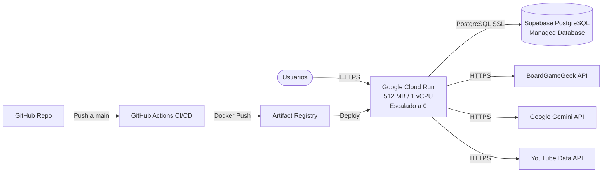

# 🚀 Guía de Despliegue en Google Cloud Run y Supabase

Esta guía detalla el procedimiento paso a paso para desplegar Ludeka en **Google Cloud Run** conectado a **Supabase** aprovechando al máximo los niveles gratuitos (Free Tier).

---

## 1. Arquitectura de Despliegue



---

## 2. Beneficios del Tier Gratuito de Google Cloud Run
Google Cloud Run ofrece cada mes dentro de su capa gratuita:
- **2 millones de peticiones HTTP** al mes gratis.
- **180.000 vCPU-segundos** y **360.000 GiB-segundos** de memoria gratis.
- **Instancia activa mínima (`min-instances: 1`) y Startup CPU Boost (`--cpu-boost`):** En producción se configura una instancia fija para eliminar los *cold starts*. Con CPU bajo demanda (`--cpu-throttling`, por defecto), la instancia en reposo solo computa coste de memoria (~3-4 €/mes con 512 MiB), cubierto holgadamente por el crédito mensual. Además, `--cpu-boost` duplica la CPU en arranques para acelerar despliegues o escalados. Si se prefiere coste estrictamente cero, puede bajarse a `min-instances: 0`.

---

## 3. Paso a Paso: Configuración en Google Cloud

### Paso 3.1: Crear Proyecto y Habilitar Servicios
Desde la consola web de Google Cloud (o Google Cloud Shell):
```bash
# 1. Definir variables
export PROJECT_ID="ludeka-prod"
export REGION="europe-west1" # Madrid / Bélgica / Frankfurt

# 2. Configurar el proyecto
gcloud config set project $PROJECT_ID

# 3. Habilitar las APIs necesarias
gcloud services enable \
    run.googleapis.com \
    artifactregistry.googleapis.com \
    secretmanager.googleapis.com \
    cloudbuild.googleapis.com
```

### Paso 3.2: Crear Repositorio en Artifact Registry y Política de Limpieza
```bash
# 1. Crear el repositorio Docker
gcloud artifacts repositories create ludeka \
    --repository-format=docker \
    --location=$REGION \
    --description="Imágenes Docker de Ludeka"

# 2. Configurar política de limpieza (conservar las 5 imágenes más recientes para evitar acumulación)
cat << 'EOF' > cleanup-policy.json
[
  {
    "name": "keep-recent-images",
    "action": {"type": "Keep"},
    "mostRecentVersions": {
      "keepCount": 5
    }
  }
]
EOF

gcloud artifacts repositories set-cleanup-policies ludeka \
    --project=$PROJECT_ID \
    --location=$REGION \
    --policy=cleanup-policy.json \
    --no-dry-run
```

### Paso 3.3: Crear Cuenta de Servicio para GitHub Actions
```bash
# 1. Crear Service Account
gcloud iam service-accounts create github-deployer \
    --display-name="GitHub Actions Deployer"

# 2. Asignar roles necesarios
gcloud projects add-iam-policy-binding $PROJECT_ID \
    --member="serviceAccount:github-deployer@$PROJECT_ID.iam.gserviceaccount.com" \
    --role="roles/run.admin"

gcloud projects add-iam-policy-binding $PROJECT_ID \
    --member="serviceAccount:github-deployer@$PROJECT_ID.iam.gserviceaccount.com" \
    --role="roles/artifactregistry.writer"

gcloud projects add-iam-policy-binding $PROJECT_ID \
    --member="serviceAccount:github-deployer@$PROJECT_ID.iam.gserviceaccount.com" \
    --role="roles/iam.serviceAccountUser"

# 3. Generar clave JSON para GitHub Secrets
gcloud iam service-accounts keys create sa-key.json \
    --iam-account=github-deployer@$PROJECT_ID.iam.gserviceaccount.com
```

---

## 4. Configuración de Secretos en GitHub

En tu repositorio de GitHub (`https://github.com/IGutierrezZ/ludeka`), ve a:  
**Settings** ➔ **Secrets and variables** ➔ **Actions** ➔ **New repository secret**.

Añade los siguientes secretos:

| Nombre del Secreto | Descripción | Ejemplo / Valor |
|---|---|---|
| `GCP_PROJECT_ID` | ID de tu proyecto en Google Cloud | `ludeka-prod` |
| `GCP_REGION` | Región de despliegue | `europe-west1` |
| `GCP_SA_KEY` | Contenido completo del archivo `sa-key.json` | `{"type": "service_account", ...}` |
| `SUPABASE_DB_CONNECTION` | Cadena de conexión PostgreSQL de Supabase | `Host=db.xxxx.supabase.co;Port=5432;Database=postgres;Username=postgres;Password=...;SSL Mode=Require;Trust Server Certificate=true;` |
| `GEMINI_API_KEY` | Clave API de Google Gemini | `AIzaSy...` |
| `BGG_API_TOKEN` | Token de BoardGameGeek (si dispones de él) | *(opcional)* |
| `YOUTUBE_API_KEY` | Clave API de YouTube Data v3 | `AIzaSy...` |
| `DISCORD_WEBHOOK_URL` | Webhook del canal de Discord de Ludeka | `https://discord.com/api/webhooks/...` |
| `TELEGRAM_BOT_TOKEN` | Token del bot de Telegram | `123456:ABC-DEF...` |
| `TELEGRAM_CHAT_ID` | Chat ID o canal de Telegram | `@ludeka_comunidad` |

---

## 5. Configuración de la Base de Datos en Supabase

1. En tu panel de **Supabase**, ve a **Project Settings** ➔ **Database** ➔ **Connection parameters**.
2. Copia la cadena en formato **URI** o **Connection string (Node.js/ADO.NET)**:
   ```
   Host=aws-0-eu-central-1.pooler.supabase.com;Port=6543;Database=postgres;Username=postgres.tu-proyecto;Password=TU_PASSWORD;SSL Mode=Require;Trust Server Certificate=true;
   ```
   *(Nota: Puedes usar tanto el puerto directo `5432` como el Transaction Pooler `6543` de Supabase).*
3. Al arrancar Ludeka por primera vez contra Supabase, **las migraciones oficiales de Entity Framework Core se ejecutarán automáticamente**, creando todas las tablas e índices nativos `jsonb`. El Administrador Fundador **ya no se siembra con un correo fijo**: en `Production` la aplicación exige `AdminUser__Email` explícito y **aborta el arranque si falta** (§9.0, paso `1-bis`); el correo sembrado es el que se haya informado, y el sembrado es irreversible por la vía de la aplicación (§10.4). Fuera de `Production` sigue vigente el respaldo existente (`admin@ludeka.es`, `AdminUserSeeder.cs:41`, read-only).
4. No ejecutes [`docs/database/supabase_schema.sql`](file:///c:/repos/Ludeka/docs/database/supabase_schema.sql) a mano en el **SQL Editor de Supabase**. Desde el INC-48 es un **derivado regenerado** desde las migraciones y ya no contradice al modelo, pero sigue siendo de referencia y auditoría: las migraciones son la única fuente de verdad, y `MigrateAsync()` las aplica solo en el despliegue del servicio web. **Los Cloud Run Jobs nunca migran** (§9.0, paso 1).

---

## 6. Despliegue Manual con gcloud CLI (Alternativa a GitHub Actions)

Si deseas desplegar directamente desde tu terminal local con Docker:

```bash
# 1. Compilar y publicar imagen Docker
gcloud builds submit --tag europe-west1-docker.pkg.dev/$PROJECT_ID/ludeka/ludeka-web:latest

# 2. Desplegar en Cloud Run
gcloud run deploy ludeka-web \
    --image=europe-west1-docker.pkg.dev/$PROJECT_ID/ludeka/ludeka-web:latest \
    --region=europe-west1 \
    --platform=managed \
    --allow-unauthenticated \
    --port=8080 \
    --memory=512Mi \
    --cpu=1 \
    --min-instances=1 \
    --max-instances=2 \
    --cpu-boost \
    --set-env-vars="ASPNETCORE_ENVIRONMENT=Production,Database__Provider=PostgreSql,Database__SeedDemoData=false,Bgg__SimulateApi=false,Gemini__Simulate=false,YouTube__Simulate=false,CommunityNotifications__DryRun=false" \
    --set-env-vars="ConnectionStrings__DefaultConnection=Host=db.xxxx.supabase.co;Port=5432;Database=postgres;Username=postgres;Password=TU_PASSWORD;SSL Mode=Require;Trust Server Certificate=true;"
```

---

## 7. Despliegue Alternativo en VPS con Docker Compose

Si prefieres alojar el contenedor en un servidor VPS propio (ej. Hetzner, OVH, DigitalOcean) en lugar de Google Cloud:

```bash
# 1. Clonar el repositorio y copiar .env
cp .env.example .env
nano .env # Completar variables de Supabase y APIs

# 2. Levantar con Docker Compose de producción
docker compose -f docker-compose.prod.yml --env-file .env up -d --build
```

---

## 8. Notas Operativas (PostgreSQL en Producción)

- **Acceso a secretos:** la cuenta de servicio que ejecuta el runtime necesita `roles/secretmanager.secretAccessor` para leer los secretos almacenados en Secret Manager.
- **Medios en Cloudflare R2:** `Cloudflare__AccountId`, `Cloudflare__AccessKeyId` y `Cloudflare__SecretAccessKey` se inyectan como `secrets:` desde Secret Manager; `Cloudflare__BucketName`, `Cloudflare__PublicCdnBaseUrl` y `Cloudflare__Simulate=false` van como `env_vars:` (ver `.github/workflows/ci-cd.yml`). Sin `Cloudflare__Simulate=false`, `CloudflareR2Options.HasValidCredentials` sigue exigiendo `!Simulate` y el almacenamiento cae en memoria sin ningún síntoma visible aunque las tres credenciales estén bien inyectadas.
- **Liveness y readiness probes:** `/healthz` y `/ready` quedan configurados como sondas del propio despliegue — ver la subsección 8.1 para el mecanismo exacto y su alcance de verificación.

### 8.1. Sondas de liveness y readiness en Cloud Run

`google-github-actions/deploy-cloudrun@v2` no tiene entradas nativas para sondas. Su entrada `metadata` (YAML de servicio) tampoco sirve para este pipeline: la documentación de la acción advierte que al usarla se ignora el resto de entradas (`image`, `region`, `env_vars`, `secrets`), lo que rompería el paso actual. La vía que usa `ci-cd.yml` es `flags`, que reenvía banderas arbitrarias a `gcloud run deploy` — y esa orden sí expone una bandera por sonda:

| Bandera | Claves admitidas |
|---|---|
| `--liveness-probe=[KEY=VALUE,...]` | `initialDelaySeconds`, `timeoutSeconds`, `periodSeconds`, `failureThreshold`, `httpGet.port`, `httpGet.path`, `grpc.port`, `grpc.service` |
| `--readiness-probe=[KEY=VALUE,...]` | `timeoutSeconds`, `periodSeconds`, `failureThreshold`, `successThreshold`, `httpGet.port`, `httpGet.path`, `grpc.port`, `grpc.service` |

⚠️ Las dos banderas no son intercambiables: `--readiness-probe` no admite `initialDelaySeconds` y `--liveness-probe` no admite `successThreshold`.

El contenedor escucha en el puerto 8080, así que `ci-cd.yml` configura:

```
--liveness-probe=httpGet.path=/healthz,httpGet.port=8080
--readiness-probe=httpGet.path=/ready,httpGet.port=8080
```

> [!WARNING]
> **Verificado solo contra la documentación oficial de `gcloud run deploy`, nunca contra un despliegue real** — no existe entorno de GCP en este ciclo. Es el mismo tipo de hueco que dejó INC-47 con la ortografía de `gcloud run jobs deploy` (§9.0, paso 5): quien provisione por primera vez debe comprobar que ambas banderas se aceptan tal cual antes de darlo por bueno.

---

## 9. Trabajos en Segundo Plano: Cloud Run Jobs + Cloud Scheduler (INC-47)

> [!IMPORTANT]
> 🚨 **PUERTA DE PRIMER DESPLIEGUE — léela antes de configurar GCP por primera vez.**
>
> El host web (`Ludeka.Web`) **ya no ejecuta ningún trabajo de negocio en proceso**: los cuatro `IHostedService` se retiraron el 2026-09-19 (PR #60). A partir de ahí, **el único ejecutor de los cuatro trabajos es Cloud Run Jobs disparado por Cloud Scheduler**.
>
> Esa retirada se mergeó sin riesgo porque **en ese momento no existía ningún entorno de producción**: no había proyecto de GCP, ni base de datos de Supabase, ni despliegue. Todos los pasos de despliegue de `.github/workflows/ci-cd.yml` están condicionados a `has_gcp == 'true'`, que exige los secretos `GCP_PROJECT_ID` y `GCP_SA_KEY`; sin ellos el flujo los omite. Verificado: los 26 PRs del incremento registraron «Deploy to Google Cloud Run — skipping».
>
> **La garantía no desapareció: se trasladó del merge al despliegue.** En cuanto configures esos dos secretos, el primer `push` a `main` desplegará el servicio web **y** publicará los cuatro Cloud Run Jobs. Si en ese momento los Cloud Scheduler y `roles/run.invoker` no están provisionados, tendrás un servicio web en producción **sin ningún ejecutor de trabajos**: ni catalogación nocturna, ni radar de precios, ni recolector social, ni drenaje del outbox de notificaciones.
>
> **Las notificaciones no se pierden en ese hueco** —el outbox es persistente y se drena cuando alguien lo ejecute—, pero se retrasan. El resto de trabajos simplemente no corren hasta que haya disparador.
>
> **Orden correcto de puesta en marcha:** ver la lista de §9.0.

Desde este incremento, la misma imagen de contenedor que publica `Ludeka.Web` (servicio HTTP) sirve también `Ludeka.Jobs` (ejecutable de vida corta, una unidad de trabajo por invocación, sin servidor HTTP ni sondas). El modo se selecciona **sobrescribiendo el `ENTRYPOINT`** del contenedor en el recurso Cloud Run Job — la imagen no cambia, solo el comando de arranque.

### 9.0. Orden de puesta en marcha (primera vez)

Sigue este orden. Los pasos 1 a 3 no despliegan nada, así que puedes hacerlos con calma; el riesgo aparece en el 4.

1. **Base de datos.** Provisiona Supabase y guarda la cadena de conexión como secreto `SUPABASE_DB_CONNECTION`. Aplica las migraciones **desde fuera del proceso de trabajo**: `Ludeka.Jobs` tiene una guarda de arranque que sale con código 3 si detecta migraciones pendientes, y nunca migra por su cuenta (§9.4).

**1-bis. Decide el correo del Administrador Fundador.** Debe ser un buzón **real y verificable por el proveedor social elegido** (Google, Discord o Facebook), y se guarda como secreto `ADMIN_USER_EMAIL`. ⚠️ **El sembrado es irreversible por la vía de la aplicación**: ocurre una sola vez, contra base vacía, en el primer arranque. Si lo informas mal, la recuperación es manual — ver §10.4.

2. **Proyecto de GCP y repositorio de artefactos.** Crea el proyecto, habilita Artifact Registry, Cloud Run, Cloud Scheduler e IAM.
3. **Cuenta de servicio del planificador**, con `roles/run.invoker` sobre los Jobs que crearás en el paso 5.

**3-bis. Dominio, apps OAuth y claves de autenticación.** Antes del paso 4, que es el que arma el despliegue automático: mapea tu dominio propio en Cloud Run (§10.1), registra las tres apps OAuth con las URL de retorno de ese dominio (§10.2) y crea en Secret Manager las claves que el paso 4 dejará operativas (§10.3).

4. **Secretos de GitHub `GCP_PROJECT_ID` y `GCP_SA_KEY`.** ⚠️ **Este es el paso que arma el despliegue.** En el siguiente `push` a `main`, el flujo dejará de omitir los pasos de despliegue: publicará el servicio web y creará los cuatro Cloud Run Jobs.
5. **Comprueba que los cuatro Jobs existen** (`gcloud run jobs list`). El paso del pipeline que los crea **nunca se ha ejecutado contra GCP real**: la ortografía de las banderas de `gcloud run jobs deploy` es un hueco de evidencia declarado desde el diseño §8.9. Si falla, corrígelo antes de seguir; no afecta al servicio web, que se despliega en un paso anterior.
6. **Crea los cuatro Cloud Scheduler** con las cadencias de §9.2, cada uno apuntando a su Job con la cuenta de servicio del paso 3. **Esto no lo hace el pipeline: es manual.**
7. **Verifica un disparo real** de cada uno (`gcloud run jobs executions list --job <nombre>`). Ojo al interpretarlo: un Job que encuentra la ventana ya completada **también sale con 0**. No prueba que hiciera trabajo, pero sí que el cableado y los permisos están bien, que es lo que necesitas saber aquí.

Hasta completar el paso 7, **el sistema no tiene ejecutor de trabajos en producción**.

### 9.1. Los cuatro Cloud Run Jobs

| Job de Cloud Run | Nombre de trabajo (`--args`) | Comando |
|---|---|---|
| `ludeka-job-nightly-cataloging` | `nightly-cataloging` | `dotnet Ludeka.Jobs.dll nightly-cataloging` |
| `ludeka-job-price-radar` | `price-radar` | `dotnet Ludeka.Jobs.dll price-radar` |
| `ludeka-job-social-collector` | `social-collector` | `dotnet Ludeka.Jobs.dll social-collector` |
| `ludeka-job-notification-outbox` | `notification-outbox` | `dotnet Ludeka.Jobs.dll notification-outbox` |

Los cuatro se despliegan sobre la **misma imagen** que el servicio web (`gcloud run jobs deploy`), con las mismas variables de entorno y secretos que el servicio (`ConnectionStrings__DefaultConnection`, `Database__Provider=PostgreSql`, tokens de BGG/Discord/Telegram, etc. — ver §4). El pipeline (`.github/workflows/ci-cd.yml`) publica una revisión nueva de los cuatro Jobs en cada despliegue, además de la revisión del servicio web.

> [!WARNING]
> **Hueco de evidencia heredado del diseño, no verificado contra GCP real en este ciclo:** la ortografía exacta de las banderas de `gcloud run jobs deploy` (en particular `--command`/`--args` para sobrescribir el `ENTRYPOINT`) y la disponibilidad de un modo *job* explícito en `google-github-actions/deploy-cloudrun@v2` no se han confirmado con acceso real a Google Cloud. Confirmar antes de dar por buena esta sección.

### 9.2. Los cuatro Cloud Scheduler

Cada Job tiene su propio Cloud Scheduler, con cadencia coherente con la ventana de idempotencia del trabajo (`JobExecutionLeases`, `UNIQUE (JobName, WindowKey)`):

| Trabajo | Cron (UTC) | Coherencia con la ventana |
|---|---|---|
| `nightly-cataloging` | `0 3 * * *` | Ventana diaria; una sola ejecución al día |
| `price-radar` | `0 */6 * * *` | Debe ser ≥ `PriceRadar:CheckIntervalHours` (6 h) |
| `social-collector` | `0 */2 * * *` | Debe ser ≥ `SocialCollector:IntervalMinutes` (120 min) |
| `notification-outbox` | `*/5 * * * *` | Ventana de un segundo: cada disparo drena el outbox pendiente |

Cada Cloud Scheduler invoca `:run` sobre su Job correspondiente con cuerpo vacío — el nombre del trabajo va fijado en el propio recurso Job (`--args`), no en la programación, para que una sobrescritura mal escrita en Scheduler nunca pueda ejecutar en silencio el trabajo equivocado.

**Nota operativa — cadencia frente a ventana:** si la cadencia del Scheduler es más frecuente que el tamaño de la ventana del trabajo (por ejemplo, un reintento manual fuera de calendario), los disparos sobrantes terminan con código de salida **0** sin hacer nada, por diseño (`SkippedAlreadyCompleted`). No es un fallo: es la misma restricción `UNIQUE (JobName, WindowKey)` que impide el trabajo duplicado. Quien revise los registros de Cloud Run debe saberlo para no perseguir un fantasma.

### 9.3. Cuenta de servicio invocadora (IAM)

Cloud Scheduler necesita una identidad autorizada para invocar cada Job:

```bash
# 1. Crear la cuenta de servicio invocadora (puede ser una sola, compartida por los 4 Scheduler)
gcloud iam service-accounts create ludeka-scheduler-invoker \
    --display-name="Ludeka Cloud Scheduler Invoker"

# 2. Autorizarla a invocar cada uno de los cuatro Jobs
for JOB in nightly-cataloging price-radar social-collector notification-outbox; do
  gcloud run jobs add-iam-policy-binding "ludeka-job-${JOB}" \
    --region="$REGION" \
    --member="serviceAccount:ludeka-scheduler-invoker@${PROJECT_ID}.iam.gserviceaccount.com" \
    --role="roles/run.invoker"
done

# 3. Configurar cada Cloud Scheduler para autenticar con esa cuenta de servicio (OIDC) al invocar
#    "https://<region>-run.googleapis.com/apis/run.googleapis.com/v1/namespaces/<project>/jobs/ludeka-job-<nombre>:run"
```

Sin el rol `roles/run.invoker` concedido, Cloud Scheduler recibe `403 Forbidden` al intentar disparar el Job — el escenario "Cloud Scheduler dispara el Job y la invocación es autorizada" (verificación manual) exige confirmar esto contra el proyecto real, no solo que el binding se creó sin error.

### 9.4. Retención de `JobExecutionLeases`

A razón de un drenaje del outbox cada 5 minutos, la tabla `JobExecutionLeases` crece aproximadamente 288 filas al día solo por ese trabajo (más las filas de los otros tres, mucho menos frecuentes). **No existe política de purga automática en el alcance de este incremento.** Se recomienda una retención operativa de **90 días** (por ejemplo, un `DELETE` programado fuera de banda sobre filas con `CompletedAt` anterior al umbral) para evitar crecimiento indefinido; queda como deuda operativa declarada, no como tarea de este incremento.

### 9.5. Hueco funcional descubierto durante `sdd-apply` (Fase 11) — sin trabajo programado de reemplazo

> [!WARNING]
> **Esto NO es una advertencia decorativa: es una pérdida de funcionalidad real a partir del merge de este PR, y ningún Cloud Scheduler de los cuatro anteriores la cubre.**
>
> `CommunityNotificationDispatcherHostedService.RunPeriodicScanAsync` —hoy con sondeo interno cada 60 minutos, todavía presente en el código pero ya sin ningún `AddHostedService` que lo arranque tras este PR— hacía DOS cosas que **ningún `IJobRunner` de `Ludeka.Jobs` reemplaza**:
>
> 1. **El boletín semanal de novedades** (`ICommunityNotificationService.RunFridayReleasesBulletinAsync`, disparado los viernes, con concesión de ventana `JobName = "community-weekly-bulletin"`).
> 2. **El escaneo de sorteos próximos a expirar** (`RunExpiringGiveawaysScanAsync`, sin concesión de ventana, ejecutado en cada vuelta del sondeo).
>
> El diseño (§7.2, tabla de trabajos, y §8.9, tabla de Cloud Scheduler) fija **exactamente cuatro** trabajos externalizados, y `community-weekly-bulletin` no es uno de ellos — nunca tuvo Cloud Run Job ni Cloud Scheduler propios. Al retirar el `AddHostedService` que lo arrancaba (requisito "El host web no ejecuta ningún trabajo de negocio en proceso", que nombra explícitamente al despachador de notificaciones comunitarias entre los cuatro tipos a retirar), **el boletín semanal y el escaneo de sorteos dejan de dispararse por completo**, de forma indefinida, hasta que alguien decida cómo reemplazarlos.
>
> Esto **no lo puede resolver `sdd-apply` dentro del alcance de las tareas 11.1-11.10**: crear un quinto Cloud Run Job y un quinto Cloud Scheduler es infraestructura nueva no aprobada por el diseño ni por el maintainer, y con el mismo gate de provisión manual que los otros cuatro. Queda como **decisión pendiente del maintainer**, con estas salidas razonables:
>
> - **(a)** Aceptar la pausa temporal del boletín semanal y del escaneo de sorteos hasta un incremento futuro que les dé un quinto trabajo programado.
> - **(b)** Añadir un quinto `IJobRunner`/Cloud Run Job/Cloud Scheduler para `community-weekly-bulletin` (la lógica de dominio ya existe en `CommunityNotificationService`; falta el *runner* fino y la infraestructura de disparo).
> - **(c)** Cualquier otro mecanismo de disparo que el maintainer prefiera (por ejemplo, ampliar el `notification-outbox` existente para que también revise el boletín semanal en cada drenaje, aunque eso mezclaría dos responsabilidades con cadencias muy distintas en un mismo trabajo).
>
> Este hueco es independiente del gate de producción del §3/§9 (que exige confirmar que los CUATRO Cloud Scheduler existentes disparan de verdad): aunque ese gate se cumpla al 100 %, el boletín semanal y el escaneo de sorteos seguirán sin dispararse hasta que se resuelva este punto.

---

## 10. Dominio Propio, Apps OAuth y Primer Acceso del Administrador Fundador (INC-52)

Esta sección completa lo que dejaron abierto INC-46 (autenticación real) e INC-49 (vinculación de cuentas): cómo entra el maintainer a su propio panel en el primer despliegue, qué hay que registrar en las consolas de los proveedores sociales, y qué protege realmente la aplicación al vivir detrás del proxy de Cloud Run. Los pasos `1-bis` y `3-bis` de §9.0 remiten aquí.

### 10.1. Dominio propio en Cloud Run

**Decisión ya tomada por el maintainer, y por qué.** Google marca el mapeo de dominio en Cloud Run como *preview* y advierte literalmente: «at the moment, this option is not recommended for production services» (verificado contra la documentación oficial). Aun así, este incremento **opta por el mapeo directo**, a sabiendas de esa advertencia, porque:

- El proyecto **no tiene tráfico todavía**, así que el riesgo de latencia es bajo y sus consecuencias son reversibles.
- Un balanceador de aplicación externo global **cobra exista o no tráfico**, lo que rompería el «coste cero sin tráfico» con el que está dimensionado todo el despliegue (§2 de esta guía: 512 MB, 1 vCPU, `min-instances: 0`).
- La migración a balanceador **sigue abierta** el día en que el tráfico la justifique.

Procedimiento:

```bash
# 1. Verificar la propiedad del dominio (paso de cuenta, independiente del servicio;
#    se puede hacer antes del primer despliegue). Para un subdominio se verifica el dominio padre.
gcloud domains verify DOMINIO_BASE

# 2. Crear el mapeo. La orden GA "domain-mappings create" es para Cloud Run for Anthos/GKE,
#    NO para Cloud Run gestionado: usa la variante beta.
gcloud beta run domain-mappings create --service SERVICE --domain DOMAIN --region europe-west1

# 3. Obtener los registros DNS exactos que Google exige para tu dominio.
#    Los valores NO son constantes públicas: los entrega Google al crear el mapeo.
#    No los inventes ni los copies de ningún blog.
gcloud beta run domain-mappings describe --domain DOMAIN --region europe-west1
```

| Caso | Tipo de registro DNS |
|---|---|
| Dominio raíz o ápex (`tudominio.com`, nombre `@`) | `A` y `AAAA` |
| Subdominio (`www.` o `app.`) | `CNAME` |

> [!WARNING]
> **Trampa del registro CAA — falla en silencio.** Cita literal de la documentación oficial: «If you use Certification Authority Authorization (CAA) DNS records for your custom domain, authorize both `pki.goog` and `letsencrypt.org`.» Si tu dominio ya tiene registros CAA restrictivos y no autorizas esas dos entidades, **la emisión del certificado falla sin ningún error visible**: el mapeo se queda esperando un certificado que nunca llega. Comprueba tus registros CAA existentes antes de mapear.

Plazo habitual del certificado gestionado: unos 15 minutos, hasta 24 horas. No admite comodines ni permite subir un certificado propio en esta modalidad.

**Hueco declarado, no confirmado contra fuente primaria:** el número exacto de registros `A`/`AAAA` para el ápex, y si el servicio queda inaccesible por HTTPS mientras se aprovisiona el certificado. Obtén los valores reales con el `describe` del paso 3; no dirijas tráfico real al dominio hasta confirmar el certificado activo.

### 10.2. Registro de las tres apps OAuth

Mapea el dominio **antes** de registrar las apps, para no tener que retocar tres consolas después. Las URL de retorno son constantes del código (`src/Ludeka.Web/Authentication/ExternalAuthenticationSchemes.cs:36-38`):

| Proveedor | URL de retorno exacta |
|---|---|
| Google | `https://<dominio>/signin-google` |
| Discord | `https://<dominio>/signin-discord` |
| Facebook | `https://<dominio>/signin-facebook` |

El primer despliegue solo cablea Google y Discord en `ci-cd.yml` (§10.3); Facebook queda fuera hasta que se resuelva la revisión de aplicaciones de Meta.

### 10.3. Entradas de Secret Manager a crear antes del paso 4

El paso 4 de §9.0 arma el despliegue automático. Antes de llegar a él, crea estas entradas en Secret Manager — son exactamente las que `ci-cd.yml` inyecta al servicio web (nunca a los cuatro Cloud Run Jobs, que no atienden HTTP ni siembran usuarios):

| Entrada de Secret Manager | Clave de configuración de destino |
|---|---|
| `GOOGLE_OAUTH_CLIENT_ID` | `Authentication__Providers__Google__ClientId` |
| `GOOGLE_OAUTH_CLIENT_SECRET` | `Authentication__Providers__Google__ClientSecret` |
| `DISCORD_OAUTH_CLIENT_ID` | `Authentication__Providers__Discord__ClientId` |
| `DISCORD_OAUTH_CLIENT_SECRET` | `Authentication__Providers__Discord__ClientSecret` |
| `FACEBOOK_OAUTH_APP_ID` | `Authentication__Providers__Facebook__AppId` |
| `FACEBOOK_OAUTH_APP_SECRET` | `Authentication__Providers__Facebook__AppSecret` |
| `INSTAGRAM_ACCESS_TOKEN` | `Instagram__AccessToken` |
| `INSTAGRAM_ACCOUNT_ID` | `Instagram__InstagramAccountId` |
| `ADMIN_USER_EMAIL` | `AdminUser__Email` |

La cuenta de servicio que ejecuta el despliegue necesita `roles/secretmanager.secretAccessor` sobre cada una (§8, "Acceso a secretos"). Si falta cualquier entrada, el despliegue del servicio web falla al arrancar el contenedor.

### 10.4. Primer acceso del Administrador Fundador

**Esto no estaba escrito en ningún documento del repositorio antes de este incremento: es conducta emergente entre INC-46 e INC-49.**

En el primer arranque contra base vacía, `AdminUserSeeder` crea la fila del Administrador Fundador con `Role = FoundingTeam` y permisos completos, **con cero filas en `ExternalLogins`** (`AdminUserSeeder.cs:56-69`, read-only): con esa fila, por sí sola, no se puede iniciar sesión.

Quien la activa es la rama **2a** de `ExternalLoginService.ResolveAsync` (escenario «Correo verificado coincide con una cuenta sin identidades externas previas» de `social-login-authentication`): el maintainer inicia sesión social con un correo que su proveedor reporta como verificado y que coincide con `AdminUser:Email`; el método localiza la cuenta por correo, comprueba que no tiene proveedores vinculados, crea el vínculo y devuelve esa misma cuenta con sus permisos intactos.

**El primer inicio de sesión social cuyo correo verificado coincida con `AdminUser:Email` ES la puerta de entrada. No hay ningún paso adicional.**

Condición dura, y aquí es donde suele fallar sin avisar: el buzón debe ser **verificable por el proveedor que uses**, y cada proveedor llama distinto a "verificado" (`ExternalAuthenticationSchemes.cs:198,212,227`):

| Proveedor | Claim que Ludeka lee como "verificado" |
|---|---|
| Google | `email_verified` |
| Discord | `verified` |
| Facebook | `verified` |

Si tu cuenta social no tiene ese correo verificado ante el proveedor, el primer acceso del fundador no funciona aunque `AdminUser__Email` esté bien escrito.

El correo se normaliza a minúsculas al sembrar (`AdminUserSeeder.cs:41`, read-only): verifica siempre con el correo en minúsculas.

**Camino manual de recuperación si se sembró un correo equivocado:**

1. **Más directo:** corrige a mano el campo `Email` de esa fila en Supabase (SQL Editor) para que coincida con el correo verificado real.
2. **Alternativa vía redespliegue:** el sembrador (`AdminUserSeeder.cs:44-53`, read-only) busca una fila existente por `Id == "admin-fundador"` **o** por `Email` antes de decidir si promueve esa fila o crea una nueva, y **nunca reescribe el `Email` de la fila que promueve**. Por eso, degradar la fila mal sembrada (quitarle `FoundingTeam`) sin borrarla y redesplegar con el `AdminUser__Email` corregido **no basta por sí solo**: como nadie fija `AdminUser__Id`, esa misma fila sigue teniendo `Id = "admin-fundador"` y vuelve a coincidir primero, así que se promueve de nuevo con su correo antiguo. Esta vía solo funciona si, además, esa fila se borra (o se le cambia el `Id`) antes de redesplegar.

### 10.5. Qué hace la aplicación detrás del proxy

- **Solo se confía en `X-Forwarded-Proto`.** `X-Forwarded-Host` y `X-Forwarded-For` no se procesan: son las dos cabeceras con las que de verdad se suplantan enlaces y controles de acceso, y no procesarlas vale más que confiar en que nunca lleguen manipuladas.
- **Las listas de confianza (`KnownProxies`, `KnownIPNetworks`) van vacías a propósito.** No hay una IP de front-end de Cloud Run estable que declarar. Lo que mitiga aceptar la cabecera desde cualquier origen no es restringir quién puede mandarla, sino **limitar qué se hace con ella**: solo se procesa el esquema, nunca el host ni la IP, así que lo peor que logra un cliente que llegue sin pasar por el proxy es mentirse a sí mismo sobre su propio esquema — no afecta a terceros ni eleva privilegios.
- **`ForwardLimit = 1`** porque el mapeo de dominio directo (§10.1) introduce un único salto de proxy. **Si algún día se migra a un balanceador de aplicación global, el salto pasa a ser doble y este valor debe subir a `2`** — es el tipo de ajuste que nadie recuerda cuando cambia la topología, y que reintroduce el defecto original de este incremento sin ningún síntoma visible.
- **Nada del código lee la IP remota hoy.** Si un futuro incremento necesita la IP real del cliente, deberá añadir `ForwardedHeaders.XForwardedFor` explícitamente y con su propia prueba — no se puede asumir que ya está disponible.
- **La garantía completa depende de que todo el tráfico entre por el front-end de Cloud Run.** Si en algún momento el contenedor se expone por otra vía (una VPC, un puerto adicional, un despliegue paralelo), esta decisión hay que revisarla desde cero.
- **`UseHttpsRedirection()` se conserva sin tocar** (`Program.cs:232`) y no produce bucle: el middleware necesita resolver un puerto HTTPS para actuar, no hay ninguna variable `HTTPS_PORT`/`ASPNETCORE_HTTPS_PORT` en este despliegue y Kestrel solo se vincula a HTTP, así que hoy se limita a avisar y apagarse. El riesgo solo aparecería si algún día se configura un puerto HTTPS resoluble **sin** que `UseForwardedHeaders` esté corrigiendo antes el esquema — no toques uno sin revisar el otro.
