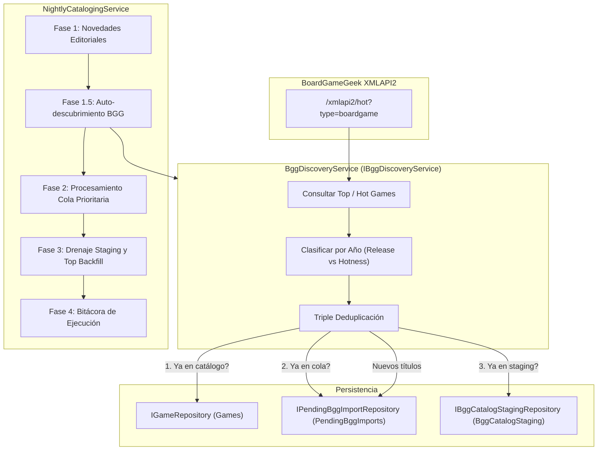

# 29. Ingesta Continua y Auto-Descubrimiento de Novedades BGG en el Lote Nocturno

> **Módulo del Sistema:** Ingesta Continua y Auto-Descubrimiento BGG  
> **Incremento Asociado:** INC-43 (`change-43-ingesta-continua-bgg`)  
> **Capa Arquitectónica:** `Ludeka.Core` / `Ludeka.Application` / `Ludeka.Infrastructure` / `Ludeka.Web`  
> **Cobertura de Pruebas:** 968 pruebas unitarias automáticas pasando al 100%.

---

## 1. Propósito y Responsabilidades
Este subsistema garantiza que Ludeka mantenga un catálogo permanentemente actualizado con la actualidad lúdica global, detectando e ingiriendo de forma automatizada tanto los nuevos lanzamientos del año como los juegos con picos de tendencia internacional en BoardGameGeek:

1. **Auto-descubrimiento en Tendencias Mundiales (Hotness):** Sondeo recurrente del endpoint oficial `/xmlapi2/hot?type=boardgame` para detectar títulos con tracción activa.
2. **Filtrado por Novedades del Año:** Discriminación automática de juegos cuyo año de publicación corresponda al año en curso (`DateTime.UtcNow.Year`) o año anterior (`DateTime.UtcNow.Year - 1`).
3. **Triple Deduplicación Robusta:** Verificación secuencial contra el catálogo publicado (`Games`), la cola de importación (`PendingBggImports`) y la tabla intermedia de staging masivo (`BggCatalogStaging`).
4. **Encolado con Orígenes Tipados:** Incorporación en cola con `CatalogQueueOrigin.BggNewReleases` o `CatalogQueueOrigin.BggHotness`.
5. **Orquestación en Lote Nocturno (Fase 1.5):** Ejecución desatendida previa al procesamiento de la cola diaria, permitiendo que las tendencias descubiertas puedan catalogarse y sintetizarse esa misma noche si el cupo lo permite.
6. **Operaciones y UI Editorial en `/admin/cola-catalogacion`:** Acción de administración *"Escanear Novedades BGG"*, visualización de métricas de escaneo, filtros por nuevos orígenes y badges visuales con icono Lucide (`TrendingUp`, `Sparkles`) libres de emojis.

---

## 2. Diagrama de Arquitectura y Flujo



---

## 3. Modelo de Dominio y Enumeraciones

### 3.1 `CatalogQueueOrigin` (`Ludeka.Core.Enums`)
- `UserImport (0)`: Solicitado comunitariamente por un usuario al sincronizar su colección BGG.
- `NewsDiscovery (1)`: Extraído de anuncios o noticias de editoriales españolas.
- `TopBggBackfill (2)`: Relleno automático con los mejores juegos históricos de BGG para completar el cupo diario.
- `BggNewReleases (3)`: Lanzamiento reciente del año detectado de forma proactiva en BGG.
- `BggHotness (4)`: Juego en el top de tendencias mundiales detectado en el Hotness de BGG.

### 3.2 `NightlyCatalogingExecutionLog` (`Ludeka.Core.Entities`)
- Propiedad `BggDiscoveryCount`: Almacena el número total de juegos de BGG descubiertos y agregados a la cola durante el ciclo.
- Método `Complete(..., int bggDiscovery = 0)`: Persiste la métrica en la bitácora estructurada de administración.

---

## 4. Contratos y Casos de Uso

### `IBggDiscoveryService` (`Ludeka.Application.Contracts`)
```csharp
public interface IBggDiscoveryService
{
    Task<BggDiscoveryResultDto> DiscoverAndEnqueueBggTrendsAsync(int maxItems = 50, CancellationToken ct = default);
    Task<BggDiscoveryResultDto> DiscoverAndEnqueueNewReleasesAsync(int? targetYear = null, int maxItems = 50, CancellationToken ct = default);
}
```

### `BggDiscoveryResultDto` (`Ludeka.Application.DTOs`)
- `TotalScanned`: Títulos analizados en BGG.
- `DiscoveredCount`: Títulos inéditos identificados.
- `EnqueuedCount`: Títulos efectivamente agregados a la cola.
- `AlreadyCatalogedCount`: Títulos ya existentes en catálogo.
- `AlreadyInQueueCount`: Títulos ya presentes en espera o en staging.
- `EnqueuedTitles`: Lista de títulos incorporados.

---

## 5. UI Editorial y Administración (`CatalogQueueAdmin.razor`)
- Ruta: `/admin/cola-catalogacion`.
- Botón de acción: *"Escanear Novedades BGG"* con icono Lucide `<Icon Name="trending-up" />`.
- Tarjeta KPI: *"Tendencias BGG"* con conteo en vivo de juegos pendientes originados por BGG.
- Selector de filtros de origen: incluye opciones para *"Novedades BGG"* y *"Tendencia BGG"*.
- Badges editoriales en tabla:
  - Novedades BGG: fondo ámbar con icono `sparkles`.
  - Tendencias BGG: fondo fucsia/rose con icono `trending-up`.
- Cumplimiento estricto del contrato `WebMarkupContractTests`: cero emojis de interfaz gráfica.
