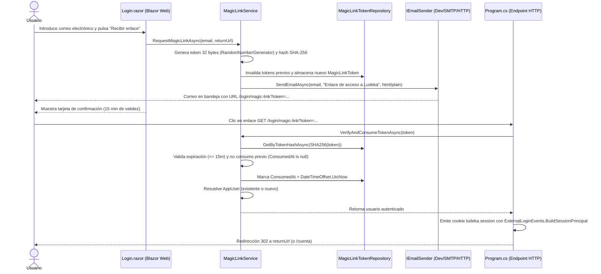

# 40. Acceso por Correo con Enlace Mágico (Magic Link)

> **Módulo:** Identidad, Autenticación y Acceso Alternativo  
> **Estado:** Implementado y Verificado  
> **Incremento origen:** [INC-64 (inc-64-acceso-por-correo.md)](file:///c:/repos/Ludeka/docs/increments/archive/inc-64-acceso-por-correo.md)  
> **Pruebas automáticas asociadas:** 1.756 pruebas unitarias pasando al 100% (45 pruebas específicas añadidas en este módulo)

---

## 1. Propósito y Contexto de Negocio

El acceso a Ludeka dependía exclusivamente de proveedores de identidad OAuth externos (Google, Discord y Facebook opcional; ver módulos 32, 33 y 36). Sin embargo, la pantalla de acceso (`Login.razor`) contenía la promesa histórica:
> *«...sin registro, sin contraseña y sin correo de confirmación.»*

Esta afirmación era contradictoria si se pretendía habilitar el acceso mediante correo electrónico. Tras la evaluación arquitectónica y la decisión explícita del mantenedor en INC-64, se adoptó el modelo de **Magic Link (enlace de un solo uso a la bandeja)** en lugar de contraseñas tradicionales:
1. **Sin contraseñas:** Erradica el almacenamiento, cifrado, filtraciones o reseteos de credenciales vulnerables.
2. **Verificación implícita y honesta:** Acceder mediante el enlace del correo demuestra de forma inequívoca el control del buzón.
3. **Cero fricción:** El usuario no requiere memorizar nada; basta con su correo para recibir un enlace de un solo clic que inicia sesión inmediatamente.
4. **Respeto a las identidades OAuth:** Si el correo ya pertenece a un `AppUser` existente (creado previamente por Google o Discord), la sesión se vincula limpiamente a esa misma cuenta sin duplicidades ni colisiones. Si es un usuario nuevo, se crea su cuenta comunitaria activa de forma automática.

---

## 2. Arquitectura y Dominio

### 2.1 Entidad de Dominio: `MagicLinkToken` (`Ludeka.Core.Entities`)
- **`Id` (`Guid`):** Identificador primario inmutable.
- **`Email` (`string`):** Correo electrónico normalizado en minúsculas (longitud máxima 200).
- **`TokenHash` (`string`):** Resumen criptográfico SHA-256 en hexadecimal del token crudo (longitud 64). El token en claro nunca se almacena en base de datos.
- **`CreatedAt` (`DateTimeOffset`):** Marca temporal de generación en UTC.
- **`ExpiresAt` (`DateTimeOffset`):** Límite temporal estricto (15 minutos por defecto).
- **`ConsumedAt` (`DateTimeOffset?`):** Marca de consumo atómico. Si no es nulo, el token ha sido usado y queda invalidado de por vida.
- **`TargetUserId` (`string?`):** Identificador del usuario destino si la cuenta ya existía previamente al generar el enlace.
- **Métodos de dominio:**
  - `IsExpired(DateTimeOffset now)`: Comprueba si ha vencido el tiempo de validez.
  - `IsConsumed()`: Comprueba si ya fue canjeado.
  - `Consume(DateTimeOffset now)`: Invalida el token asignando `ConsumedAt` o lanza `InvalidOperationException` si ya estaba consumido o expirado.

---

## 3. Contratos de Aplicación (`Ludeka.Application.Contracts`)

- **`IMagicLinkTokenRepository`:**
  - `SaveAsync(MagicLinkToken token, CancellationToken ct)`: Persistencia del token.
  - `GetByTokenHashAsync(string tokenHash, CancellationToken ct)`: Búsqueda rápida por índice único de hash.
  - `InvalidatePendingTokensForEmailAsync(string email, CancellationToken ct)`: Marca de consumo o limpieza de enlaces pendientes anteriores para ese buzón.
  - `DeleteExpiredTokensAsync(DateTimeOffset threshold, CancellationToken ct)`: Higiene de tokens obsoletos.
- **`IEmailSender`:**
  - `SendEmailAsync(string toEmail, string subject, string htmlContent, string plainTextContent, CancellationToken ct)`: Abstracción agnóstica para el envío transaccional de correo.
- **`IMagicLinkService`:**
  - `RequestMagicLinkAsync(string email, string? returnUrl, CancellationToken ct)`: Orquesta la generación, almacenamiento y despacho de correo.
  - `VerifyAndConsumeTokenAsync(string token, CancellationToken ct)`: Canjea el token de forma atómica y resuelve la identidad del usuario.

---

## 4. Persistencia e Infraestructura (`Ludeka.Infrastructure`)

1. **Mapeo EF Core (`LudekaDbContext`):**
   - Configuración de la entidad `MagicLinkToken` en tabla `"MagicLinkTokens"`.
   - Índice combinado `"IX_MagicLinkTokens_Email_CreatedAt"` sobre `(Email, CreatedAt)`.
   - Índice único `"IX_MagicLinkTokens_TokenHash"` sobre `TokenHash`.
2. **Reconciliación SQLite Local (`SqliteSchemaMigrator`):**
   - Bloque 29: Creación idempotente de tabla `MagicLinkTokens` con sus columnas y los dos índices en entornos SQLite.
3. **Migración PostgreSQL / Supabase:**
   - Migración EF Core `20260925164853_AddMagicLinkTokens.cs`.
   - Actualización del volcado maestro `docs/database/supabase_schema.sql` custodiada por `SupabaseSchemaFreshnessTests`.
4. **Emisor de Correo para Desarrollo (`DevelopmentEmailSender`):**
   - Implementación de `IEmailSender` que registra el contenido del correo y el enlace de acceso completo en el logger del sistema (`ILogger<DevelopmentEmailSender>`).
   - Facilita el desarrollo y pruebas automatizadas locales sin necesidad de servidor SMTP ni costes de servicios externos.
   - En producción (Cloud Run), se inyectará el proveedor HTTP transaccional correspondiente (puerto 587 o API REST tipo Resend/Brevo, evitando el bloqueo del puerto 25 en Google Cloud).

---

## 5. Endpoints HTTP y Seguridad Web (`Ludeka.Web`)

Los endpoints se exponen directamente en el pipeline HTTP en `Program.cs` para garantizar el manejo canónico de cookies de sesión:

1. **`POST /login/magic-link/request`:**
   - Recibe `email` y `returnUrl` (opcional).
   - Valida la dirección y delega en `IMagicLinkService.RequestMagicLinkAsync`.
   - Responde con JSON indicando éxito y mensaje amigable.
2. **`GET /login/magic-link`:**
   - Parámetros de consulta: `token` (obligatorio) y `returnUrl` (opcional).
   - Valida y consume el token llamando a `IMagicLinkService.VerifyAndConsumeTokenAsync`.
   - Si el token es inválido o no existe, redirige a `/login?aviso=magic-link-invalido`.
   - Si el token está caducado, redirige a `/login?aviso=magic-link-expirado`.
   - Si el canje es correcto:
     - Construye el `ClaimsPrincipal` mediante `ExternalLoginEvents.BuildSessionPrincipal(user)`.
     - Emite la cookie segura `ludeka.session` (`ExternalAuthenticationSchemes.SessionCookieScheme`).
     - Valida `returnUrl` con la guarda estricta `LoginRedirect.IsLocalUrl(returnUrl)` para evitar vulnerabilidades de redirección abierta (*Open Redirect*). Si no es relativa o segura, redirige a `/cuenta`.

---

## 6. Interfaz Editorial (`Login.razor`) y Accesibilidad

1. **Honestidad del Copy:**  
   Se eliminó la afirmación contradictoria *«sin correo de confirmación»*. El lema actualizado refleja con transparencia:
   > *«Entra al instante con tu cuenta social o con un enlace mágico a tu correo: sin contraseñas.»*
2. **Formulario de Enlace Mágico:**  
   - Campo de entrada tipo `email` con autocompletado y validación.
   - Botón de envío accesible con estados de carga interactivos (`_isSubmitting`).
   - Tarjeta de éxito visual de tono verde accesible (WCAG 2.2 AA) indicando que el enlace ha sido enviado, recordando la validez de 15 minutos y la comprobación de spam.
   - En entorno de desarrollo (`Environment.IsDevelopment()`), muestra un botón directo para abrir el enlace mágico sin consultar el buzón.
   - Opción *«Probar con otro correo»* para reiniciar el formulario.
3. **Separador Visual y Acceso Social:**  
   - Divisor claro con el texto *«o entra con tu cuenta social»*.
   - Botones de autenticación externa (Google, Discord, etc.) totalmente funcionales y preservados.
4. **Manejo de Avisos Cerrados:**  
   - Integración con `LoginRedirect.ResolveAccountCollisionNotice` para interpretar los nuevos códigos `magic-link-invalido` y `magic-link-expirado` sin inyección de texto libre.

---

## 7. Pruebas Automáticas Verificadas

- **Dominio (`MagicLinkTokenTests.cs`):** 15 pruebas unitarias verificando generación de hash, invariantes de email, validación de caducidad y consumo de un solo uso.
- **Infraestructura (`MagicLinkTokenRepositoryTests.cs`, `SupabaseSchemaFreshnessTests.cs`):** 6 pruebas unitarias verificando CRUD, índices, invalidación de tokens previos e integridad del DDL de Supabase.
- **Aplicación (`MagicLinkServiceTests.cs`):** 12 pruebas unitarias cubriendo generación, envío, detección de usuario preexistente vs nuevo usuario, errores por token expirado/consumido y enlace de desarrollo.
- **Web (`LoginRedirectTests.cs`, `LoginContractTests.cs`):** 12 pruebas unitarias verificando redirecciones locales, resolución de códigos de aviso, ausencia de copy falso en Razor, presencia de controles de Magic Link y conservación de botones sociales.
- **Total de la Suite:** **1.756 pruebas unitarias** pasando al 100% en verde.
