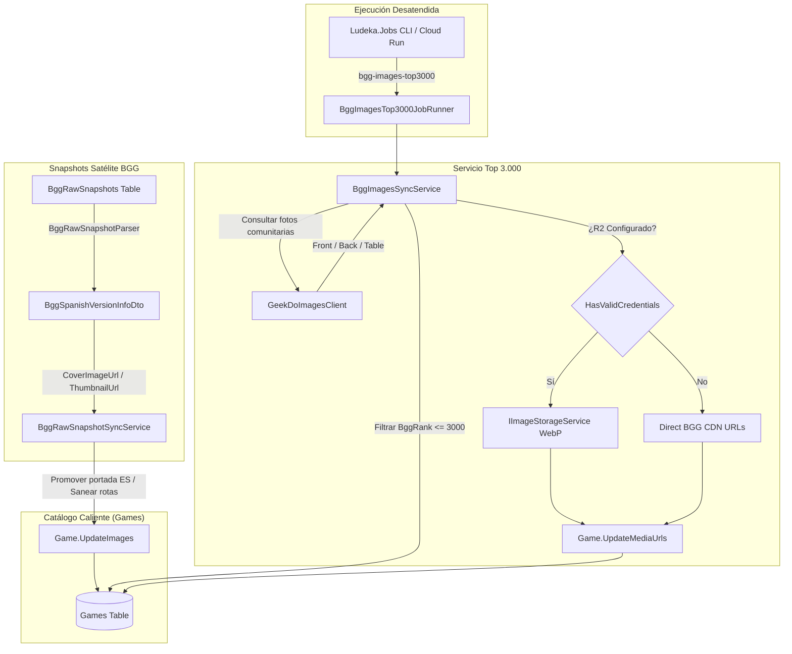

# 53. Portadas en Español desde Snapshots y Sincronización Top 3.000 BGG

> **Módulo:** 53  
> **Incremento origen:** INC-120 / INC-122  
> **Estado:** Implementado y Verificado  
> **Pruebas unitarias:** 2.604 verificadas al 100%  

---

## 1. Propósito y Alcance

Este módulo resuelve de forma definitiva la visibilidad, resolución y localización de las imágenes del catálogo caliente de Ludeka:
1. **Extracción y Priorización de Portadas en Español:** Si un juego cuenta con ediciones comerciales en español dentro del subárbol de versiones de BoardGameGeek (`<versions><item type="boardgameversion">`), se extraen sus URLs de imagen (`image`) y miniatura (`thumbnail`) y se promueven como la carátula principal (`CoverImageUrl`, `ThumbnailUrl`) de la ficha del juego, sustituyendo a la versión internacional en inglés.
2. **Jerarquía Blindada de Carátulas:** Si no existe portada específica en español, se preserva prioritariamente la portada oficial canónica de raíz de BGG (`rootCover`), impidiendo que fotos comunitarias o miniaturas pintadas por usuarios sobreescriban la carátula oficial.
3. **Calidad de Alta Resolución GeekDo y Descarte de Micro-Miniaturas (INC-122):** `GeekDoImagesClient` extrae URLs de alta resolución (`imageurl_lg` de 1024×1024 px) y descarta proactivamente cualquier URL con `__micro` o `fit-in/64x64`. Se sanean las URLs corruptas existentes en base de datos.
4. **Completitud del Trío de Imágenes con Consulta Dirigida de Contraportada (INC-122):** Se garantiza la obtención de la 3ª imagen (contraportada) mediante consulta específica a `tag=BoxBack&sort=hot&showcount=5` si no estuviera presente en la muestra general de fotos más votadas.
5. **Saneamiento Defensivo Anti-404:** Corrige y erradica los enlaces rotos originados por entornos sin almacenamiento físico (URLs efímeras simuladas `*.r2.dev/games/*` o placeholders genéricos SVG), reconstituyéndolos desde las imágenes canónicas del snapshot o las galerías comunitarias de GeekDo.
6. **Estrategia Dual Zero-Cloud / Direct CDN:** En entornos con credenciales de Cloudflare R2 (`HasValidCredentials == true`), optimiza las imágenes a WebP en bucket propio. En entornos locales o sin credenciales configuradas (`HasValidCredentials == false`), almacena directamente las URLs canónicas seguras del CDN de GeekDo/BGG (`https://cf.geekdo-images.com/...`), asegurando visibilidad inmediata sin riesgo de errores 404.
7. **Presentación Visual y Editorial Adaptada (INC-122):** En `GameImageCarousel.razor`, el visor fotográfico adopta la proporción equilibrada `aspect-square sm:aspect-[4/3] max-h-[460px]`, maximizando la escala visual de cajas verticales/cuadradas sobre fondo oscuro editorial de alto contraste (`bg-neutral-900/90`).

---

## 2. Arquitectura de Componentes



---

## 3. Modelo de Datos y Contratos

### 3.1 DTO de Versión Española (`BggSpanishVersionInfoDto`)
Ubicado en `src/Ludeka.Application/DTOs/BggVersionDtos.cs`:
```csharp
public record BggSpanishVersionInfoDto(
    string? Title,
    string? Publisher,
    int? YearPublished,
    string? Ean,
    string? ProductCode,
    string? CoverImageUrl = null,
    string? ThumbnailUrl = null
);
```

### 3.2 Contrato `IBggImagesSyncService`
Ubicado en `src/Ludeka.Application/Contracts/IBggImagesSyncService.cs`:
```csharp
public interface IBggImagesSyncService
{
    Task<BggImagesSyncResultDto> SyncTopRankedImagesBatchAsync(
        int afterRank = 0,
        int batchSize = 25,
        int maxRank = 3000,
        int delayMs = 800,
        CancellationToken ct = default);
}
```

### 3.3 Trabajo Autónomo en `Ludeka.Jobs`
- **Identificador de trabajo:** `JobNames.BggImagesTop3000 = "bgg-images-top3000"`.
- **Implementación:** `BggImagesTop3000JobRunner`, coordinado mediante `IJobExecutionCoordinator.ExecuteWithWindowLeaseAsync` y latidos `heartbeat.BeatAsync`.
- **Paginación monotónica keyset:** Itera por lotes de 25 títulos avanzando `afterRank` hasta alcanzar el rango #3.000 o agotar los títulos pendientes.

---

## 4. Reglas de Negocio e Invariantes

1. **Precedencia Localizada:** Si un snapshot de versiones contiene portada en español, se promueve prioritariamente sobre cualquier carátula internacional devuelta por GeekDo o BGG raíz.
2. **Fusión de Candidatas de Versión:** Si existen múltiples ediciones en español para un mismo juego y la candidata seleccionada por mejor código EAN carece de carátula pero otra versión en español sí la incluye, `BggRawSnapshotParser` enriquece la entidad fusionando `CoverImageUrl` y `ThumbnailUrl`.
3. **Normalización de Protocolo:** Cualquier URL relativa con prefijo `//` (ej. `//cf.geekdo-images.com/...`) se normaliza anteponiendo `https:`.
4. **Idempotencia:** Las operaciones no modifican la base de datos si las URLs calculadas son idénticas a las ya asignadas a la entidad `Game`.
5. **Aislamiento de Fallos:** Si la consulta de fotos de un juego específico en GeekDo falla o sufre timeout, la anomalía se registra en el log y el sincronizador prosigue con el siguiente título del lote.
