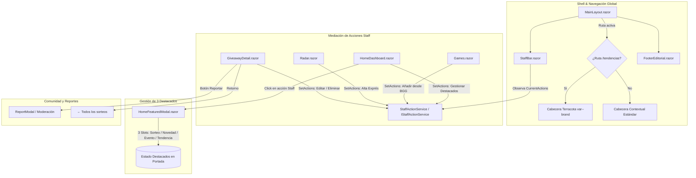

# 54. Alineación Editorial de Claude (Parte 1: Portada, Tendencias, Catálogo y Sorteos)

> **Módulo:** 54  
> **Incremento origen:** INC-121  
> **Estado:** Implementado y Verificado  
> **Pruebas unitarias:** 2.599 verificadas al 100%  

---

## 1. Propósito y Alcance

Este módulo implementa la primera fase de armonización e identidad visual de Ludeka basada en el prototipo interactivo final de referencia («Dirección C — Revista Lúdica», diseñado por Claude). Resuelve discrepancias detectadas en el Shell global, Portada, Tendencias, Catálogo de Juegos y Radar de Sorteos y Ofertas:

1. **Depuración del Shell Superior:** Retirada de la campana de notificaciones/webhooks de la cabecera superior en `MainLayout.razor` (reservada para una futura bandeja unificada de pendientes para administración).
2. **Tintado Reactivo de Tendencias y Pie de Página Editorial:**
   - La cabecera superior reacciona dinámicamente a la ruta `/tendencias` aplicando el fondo terracota (`var(--brand)` / `#BA3D2A` con texto blanco) para enfatizar la vitalidad del pulso de la comunidad.
   - Depuración del pie de página (`FooterEditorial.razor`): eliminación de frases redundantes y ajuste de márgenes verticales e interlineado para maximizar la limpieza visual.
3. **Barra Contextual Dinámica (`StaffBar` & `IStaffActionService`):**
   - Supresión de accesos fijos globales en la barra de staff.
   - Introducción del servicio mediador scoped `IStaffActionService`, permitiendo que cada pantalla pública registre de forma reactiva sus herramientas de moderación específicas (gestión de destacados en portada, importador BGG en catálogo, alta exprés en sorteos, edición/eliminación en ficha de sorteo), liberando dichos controles al desmontarse (`Dispose`).
   - Contenedor unificado alineado a la retícula maestra de 1280px (`max-w-[1280px] mx-auto px-4 sm:px-6 lg:px-8 py-2`).
4. **Portada con 3 Destacados Gestionables:**
   - Reducción de 4 a 3 tarjetas en la cinta editorial de destacados diarios.
   - Selección predeterminada inteligente: (1) Sorteo a punto de finalizar, (2) Última novedad publicada y (3) Próximo gran evento lúdico.
   - Modal interactivo de configuración (`HomeFeaturedModal.razor`) accesible exclusivamente para administradores/moderadores desde `StaffBar`, con capacidad de sustituir cualquiera de las tres posiciones por sorteos, novedades, eventos o juegos en tendencia del día.
5. **Cuentas Atrás de Sorteos Simplificadas:**
   - Eliminación del prefijo "Queda / Quedan" en las píldoras de urgencia en tarjetas y carruseles, mostrando la magnitud temporal directa (`1 día`, `3 días`, `Finaliza hoy`).
6. **Catálogo de Juegos: Numerales y StaffBar:**
   - Los números ordinales de carátula (`01, 02...`) quedan liberados del recorte `overflow-hidden` de la imagen mediante posición relativa y sombra difusa suave, reproduciendo la estética editorial de revista.
   - Acceso a importación BGG contextual en `StaffBar`.
7. **Radar de Sorteos y Ofertas:**
   - Retirada de botones redundantes en Hero ("Mis Alertas" y "Alta Exprés").
   - Traslado de "Alta Exprés" a la barra contextual `StaffBar`.
   - Paginación accesible (10 elementos por página) con controles anterior/siguiente y páginas numeradas.
   - Reasignación del icono de lápiz (✎) en tarjetas de sorteo para abrir directamente el modal de edición de datos.
8. **Ficha de Sorteo y Reporte Comunitario:**
   - Migración de las acciones administrativas (Editar y Eliminar) hacia `StaffBar`.
   - Enlace canónico de retorno `← Todos los sorteos` en sustitución del texto legacy.
   - Nuevo botón y modal accesible de «Reportar sorteo» con selección de motivos comunitarios (caducado, enlace roto, fraude/spam, datos erróneos).
   - Modernización de modales con tokens de diseño de Revista Lúdica (`bg-stone-900/60`, bordes suaves y radios consistentes).

---

## 2. Arquitectura de Componentes



---

## 3. Modelo de Contratos y Servicios

### 3.1 Contrato del Mediador de Staff (`IStaffActionService`)
Ubicado en `src/Ludeka.Application/Contracts/IStaffActionService.cs`:
```csharp
public interface IStaffActionService
{
    IReadOnlyList<StaffActionItem> CurrentActions { get; }
    event Action? OnActionsChanged;
    void SetActions(IEnumerable<StaffActionItem> actions);
    void ClearActions();
}

public record StaffActionItem(
    string Id,
    string Label,
    string IconName,
    Func<Task> Action,
    StaffActionStyle Style = StaffActionStyle.Default,
    string? RequiredPermission = null
);

public enum StaffActionStyle
{
    Default,
    Primary,
    Danger
}
```

### 3.2 Implementación Scoped (`StaffActionService`)
Ubicado en `src/Ludeka.Application/Features/Staff/StaffActionService.cs`:
- Registrado en el contenedor de dependencias (`ServiceCollectionExtensions.cs`) con ciclo de vida `Scoped`.
- Notifica cambios mediante el evento `OnActionsChanged` para que `StaffBar.razor` ejecute `InvokeAsync(StateHasChanged)`.
- Patrón de suscripción en páginas de Blazor:
```csharp
protected override void OnInitialized()
{
    StaffActionService.SetActions(new[]
    {
        new StaffActionItem("edit", "Editar sorteo", "pencil", () => OpenEditModalAsync()),
        new StaffActionItem("delete", "Eliminar sorteo", "trash-2", () => OpenDeleteModalAsync(), StaffActionStyle.Danger)
    });
}

public void Dispose()
{
    StaffActionService.ClearActions();
}
```

### 3.3 Modelo de Destacados de Portada (`HomeFeaturedItem`)
Ubicado en `src/Ludeka.Web/Components/Home/HomeFeaturedItem.cs`:
```csharp
public record HomeFeaturedItem(
    string Id,
    HomeFeaturedKind Kind,
    string Title,
    string Subtitle,
    string BadgeText,
    string ImageUrl,
    string TargetUrl
);

public enum HomeFeaturedKind
{
    Giveaway,
    News,
    Event,
    Trending
}
```

---

## 4. Pruebas y Certificación

La suite de pruebas unitarias y de integración se ejecutó de forma exhaustiva, certificando **2.599 pruebas unitarias superadas al 100%**:

| Suite de Pruebas | Foco Verificado |
|---|---|
| `StaffActionServiceTests` | Registro, emisión de eventos, limpieza y ejecución asíncrona de callbacks. |
| `MainLayoutContractTests` | Retirada del icono de campana y detección cromática de cabecera en `/tendencias`. |
| `WebMarkupContractTests` | Cumplimiento del formato de cuentas atrás sin prefijo "Queda" y validación de marcado editorial. |
| `GiveawayDetailPageContractTests` | Presencia del enlace canónico `← Todos los sorteos` y modal de reporte comunitario. |
| `AccountAreaContractTests` | Sincronización del contrato de navegación tras retiro de "Mis Alertas" en Hero de Radar. |
| **Total** | **2.599 tests unitarios (100% verde)** |
