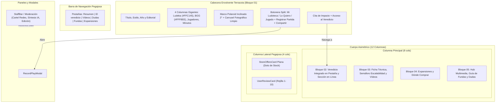

# 55. Alineación Editorial de Claude (Parte 2: Ficha de Juego en Escritorio y Móvil — Revista Lúdica)

> **Módulo:** 55  
> **Incrementos origen:** INC-123, INC-124 e INC-126  
> **Estado:** Implementado y Verificado  
> **Pruebas unitarias:** 2.627 verificadas al 100%  

---

## 1. Propósito y Alcance

Este módulo traslada la experiencia visual y editorial de la ficha de juego definida en el prototipo interactivo de referencia («Dirección C — Revista Lúdica», diseñado por Claude en `Ludeka Final.dc.html` y `Ludeka Final Movil.dc.html`) a la página Blazor interactiva `src/Ludeka.Web/Components/Pages/GameDetail.razor`:

1. **Cabecera Envolvente Terracota (`bg-[var(--brand)] text-[var(--on-brand)]`):**
   - Banda a ancho completo con migas integradas en contraste suave, títulos jerarquizados y metadatos limpios (estilo, año de publicación, editorial en España).
   - Marco polaroid físico con inclinación sutil de 2° (con efecto hover de estabilización a 0°), carrusel fotográfico (portada, trasera de caja y foto en mesa), paginador numérico (`1 / N`), miniaturas conmutables y carátula limpia sin pegatinas superpuestas (retirada la pegatina flotante de precio tras INC-124).
   - Cuatro columnas editoriales de números gigantes en escritorio y móvil (INC-126): Ludeka en mostaza (`#FFC145`), BGG en marfil (`#FFF8EE`), comensales recomendados con desglose descriptivo y duración en minutos con sufijo compacto, separadas por divisores limpios `border-l border-white/30`.
   - Simplificación del eyebrow móvil eliminando colisiones visuales de texto superpuesto.
   - Retirada de la cinta negra intermedia de mercado y de la barra inferior fija duplicada en móvil que colisionaba con `MobileBottomNav`.

2. **Botonera de Colección y Acciones Depurada:**
   - Botón split con desplegable («En mi ludoteca», «Lo quiero», «Jugado»).
   - Botón contorneado de «Registrar partida» con contador dinámico de partidas registradas por el usuario.
   - Botón circular para compartir enlace en portapapeles mediante Clipboard API con feedback táctil.
   - **Reglas de Negocio Explícitas Validadas:**
     - Se retira «Avisar si baja de precio» de la ficha (pospuesto a un futuro sistema integral de alertas).
     - Se retira «Prestar» de la ficha de juego (centralizado en la propia ludoteca del usuario).
     - «Cartel para redes» queda integrado exclusivamente en el panel y herramientas de moderación/staff (`StaffBar.razor` y herramientas administrativas).

3. **Barra Pegajosa de Pestañas (Sticky Nav) y Columnas Laterales Limpias:**
   - Barra de navegación pegajosa superior con pestañas reactivas (`Resumen`, `El veredicto`, `Vídeos`, `Dudas`, `Fundas` —condicional a la existencia de fundas—, `Expansiones`) sincronizadas bidireccionalmente.
   - Pestaña de fundas oculta condicionalmente cuando el juego no dispone de información de fundas.
   - Maquetación asimétrica de 12 columnas (8 para contenido editorial y 4 fijas en columna lateral pegajosa con `StoreOffersCard` en modo `IsSidebar="true"` y `UserReviewCard`).
   - Dónde Comprar en `StoreOffersCard`: lista editorial plana sin caja blanca ni contenedores anidados, con puntos circulares de disponibilidad (verde en stock, mostaza última unidad, gris agotado) y precio estilizado en `var(--accent)` o `var(--muted)` para títulos sin existencias.
   - Tu Valoración en `UserReviewCard`: selector numérico de 1 a 10 en rejilla de 5 columnas, con visualización destacada de 44px en estado valorado (`/10`) y botón plano «Modificar mi valoración».

4. **Secuencia de 5 Bloques Editoriales e Integración Limpia del Veredicto:**
   - Preservación estricta del orden de marcado para los 5 bloques canónicos (`bloque-01-cabecera` < `bloque-02-veredicto` < `bloque-03-ficha-tecnica` < `bloque-04-expansiones-tiendas` < `bloque-05-multimedia-comunidad`).
   - Tras INC-126, el `bloque-02-veredicto` queda integrado limpiamente en el flujo editorial del contenido principal y accesible vía pestaña dedicada «El veredicto», suprimiendo por completo el drawer modal flotante con `z-[100]`.
   - Callout destacado de veredicto en la pestaña Resumen con enlace directo a la sección completa.
   - Maquetación plana tipo revista en Bloque 03: líneas finas de corte (`border-t border-[var(--line)]`) sin cajas beige envolventes para escalabilidad, ADN lúdico y multimedia.

5. **Adaptación Móvil Extrema:**
   - Carátula 4:3 con controles táctiles y paginación por puntos (*dots*).
   - Barra fija inferior al alcance del pulgar con mejor precio hoy y botón directo de ludoteca.

---

## 2. Diagrama de Arquitectura de la Ficha

---

## 3. Contratos de Interfaz y Marcado

- **Contrato de Ausencia de Clases Prohibidas:** Cumplimiento de `WebMarkupContractTests`: prohibido `text-white` (reemplazado por `text-[#FFF8EE]` o `text-[var(--on-brand)]`), cero emojis, presencia de los 7 iconos Lucide (`globe`, `flag`, `palette`, `shopping-cart`, `bot`, `package`, `trophy`) y diseñador como texto plano sin enlace.
- **Contrato de Rejilla Asimétrica y Módulos Fijos:** Cumplimiento de `GameDetailEditorialContractTests` (`grid grid-cols-1 lg:grid-cols-12`, `lg:col-span-8`, `lg:col-span-4 lg:sticky`, `StoreOffersCard` con `IsSidebar="true"`).
- **Contrato de Orden de Bloques:** Cumplimiento de `GameDetailEditorialBlocksContractTests` (`idx1 < idx2 < idx3 < idx4 < idx5`).
