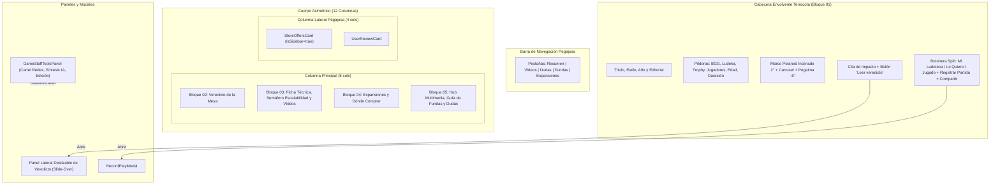

# 55. Alineación Editorial de Claude (Parte 2: Ficha de Juego en Escritorio y Móvil — Revista Lúdica)

> **Módulo:** 55  
> **Incremento origen:** INC-123  
> **Estado:** Implementado y Verificado  
> **Pruebas unitarias:** 2.617 verificadas al 100%  

---

## 1. Propósito y Alcance

Este módulo traslada la experiencia visual y editorial de la ficha de juego definida en el prototipo interactivo de referencia («Dirección C — Revista Lúdica», diseñado por Claude en `Ludeka Final.dc.html` y `Ludeka Final Movil.dc.html`) a la página Blazor interactiva `src/Ludeka.Web/Components/Pages/GameDetail.razor`:

1. **Cabecera Envolvente Terracota (`bg-[var(--brand)] text-[var(--on-brand)]`):**
   - Banda a ancho completo con migas integradas en contraste suave, títulos jerarquizados y metadatos limpios (estilo, año de publicación, editorial en España).
   - Marco polaroid físico con inclinación sutil de 2° (con efecto hover de estabilización a 0°), carrusel fotográfico (portada, trasera de caja y foto en mesa), paginador numérico (`1 / N`), miniaturas conmutable y pegatina flotante de mejor precio girada a -6°.
   - Fila compacta de píldoras editoriales en escritorio y móvil (`Rating BGG`, `Consenso Ludeka`, ranking mundial BGG con icono Lucide `trophy`, jugadores ideales, edad mínima y duración media por jugador).
   - Bloque de cita textual de alto impacto procedente del veredicto fundacional o síntesis IA con botón de acceso directo al desglose completo.

2. **Botonera de Colección y Acciones Depurada:**
   - Botón split con desplegable («En mi ludoteca», «Lo quiero», «Jugado»).
   - Botón contorneado de «Registrar partida» con contador dinámico de partidas registradas por el usuario.
   - Botón circular para compartir enlace en portapapeles mediante Clipboard API con feedback táctil.
   - **Reglas de Negocio Explícitas Validadas:**
     - Se retira «Avisar si baja de precio» de la ficha (pospuesto a un futuro sistema integral de alertas).
     - Se retira «Prestar» de la ficha de juego (centralizado en la propia ludoteca del usuario).
     - «Cartel para redes» queda integrado exclusivamente en el panel y herramientas de moderación/staff (`GameStaffToolsPanel.razor` y slide-over modal).

3. **Cinta Inversa de Mercado y Barra Pegajosa de Pestañas (Sticky Nav):**
   - Franja invertida `--inverse` con mejor precio del día, mínimo histórico, contador de vídeos y especificaciones de fundas.
   - Barra de navegación pegajosa superior con 5 pestañas reactivas (`Resumen`, `Vídeos`, `Dudas`, `Fundas`, `Expansiones`) sincronizadas bidireccionalmente.
   - Maquetación asimétrica de 12 columnas (8 para contenido editorial y 4 fijas en columna lateral pegajosa con `StoreOffersCard` en modo `IsSidebar="true"` y `UserReviewCard`).

4. **Secuencia de 5 Bloques Editoriales y Panel Lateral de Veredicto:**
   - Preservación estricta del orden de marcado para los 5 bloques canónicos (`bloque-01-cabecera` < `bloque-02-veredicto` < `bloque-03-ficha-tecnica` < `bloque-04-expansiones-tiendas` < `bloque-05-multimedia-comunidad`).
   - Semáforo de escalabilidad comunitaria de 7 columnas (`ScalabilityTrafficLight`).
   - ADN lúdico y 2 vídeos destacados en el resumen con enlace a la pestaña multimedia.
   - Panel lateral deslizable (slide-over modal / bottom sheet) para lectura del veredicto íntegro de la Mesa Fundadora, pros, contras, contexto ideal y herramientas de staff.

5. **Adaptación Móvil Extrema:**
   - Carátula 4:3 con controles táctiles y paginación por puntos (*dots*).
   - Barra fija inferior al alcance del pulgar con mejor precio hoy y botón directo de ludoteca.

---

## 2. Diagrama de Arquitectura de la Ficha

---

## 3. Contratos de Interfaz y Marcado

- **Contrato de Ausencia de Clases Prohibidas:** Cumplimiento de `WebMarkupContractTests`: prohibido `text-white` (reemplazado por `text-[#FFF8EE]` o `text-[var(--on-brand)]`), cero emojis, presencia de los 7 iconos Lucide (`globe`, `flag`, `palette`, `shopping-cart`, `bot`, `package`, `trophy`) y diseñador como texto plano sin enlace.
- **Contrato de Rejilla Asimétrica y Módulos Fijos:** Cumplimiento de `GameDetailEditorialContractTests` (`grid grid-cols-1 lg:grid-cols-12`, `lg:col-span-8`, `lg:col-span-4 lg:sticky`, `StoreOffersCard` con `IsSidebar="true"`).
- **Contrato de Orden de Bloques:** Cumplimiento de `GameDetailEditorialBlocksContractTests` (`idx1 < idx2 < idx3 < idx4 < idx5`).
