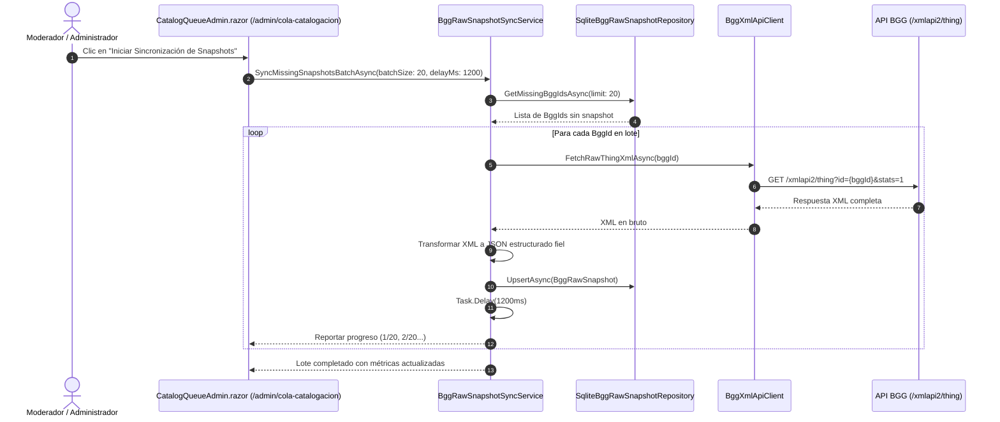
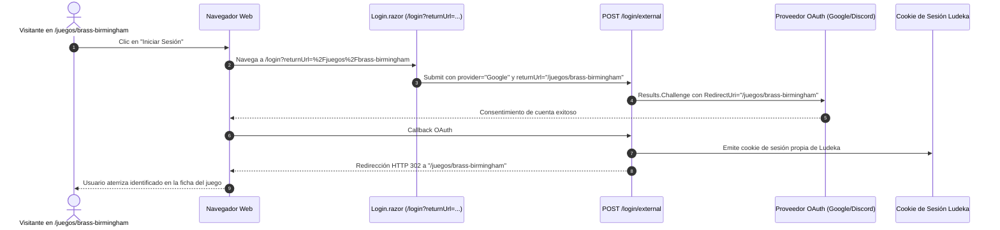

# Documento de Diseño Arquitectónico: INC-90 — Snapshots Crudos BGG, Refinamiento Integral de Catálogo, Ficha Editorial y Retorno de Sesión

> **ID del Cambio:** `change-90-bgg-raw-snapshots`  
> **Incremento Asociado:** INC-90  
> **Estado:** ⏳ Diseño en revisión  

---

## 1. Decisiones de Arquitectura (ADRs)

### Decisión D1: Almacenamiento Satélite Desacoplado para `BggRawSnapshots`
* **Contexto:** BGG devuelve payloads de 20-100 KB por juego. Guardarlos en la tabla `Games` multiplicaría el tamaño de la tabla caliente y acoplaría el modelo de dominio a esquemas externos.
* **Diseño:**
  1. Se crea la entidad de infraestructura/satélite `BggRawSnapshot`:
     ```csharp
     public class BggRawSnapshot
     {
         public int BggId { get; private set; }
         public string RawJson { get; private set; } = string.Empty;
         public int ApiVersion { get; private set; } = 2;
         public DateTimeOffset FetchedAtUtc { get; private set; }
         public DateTimeOffset? UpdatedAtUtc { get; private set; }
     }
     ```
  2. Mapeo en EF Core:
     * Tabla: `BggRawSnapshots`.
     * Clave primaria: `BggId`.
     * Columna `RawJson`: mapeada como `HasColumnType("jsonb")` en PostgreSQL y `TEXT` en SQLite.
  3. `Games` permanece completamente inalterada en su huella de I/O de disco.

### Decisión D2: Extensión de Criterios y Repositorio para Ordenación Dinámica (`GameSortOrder`)
* **Contexto:** Actualmente `SqliteGameRepository.SearchAsync` aplica un orden fijo por `BggRank` y `BggRating`.
* **Diseño:**
  1. Definición del enum en `Ludeka.Core.Enums`:
     ```csharp
     public enum GameSortOrder
     {
         Rank = 0,
         RatingDesc = 1,
         ComplexityAsc = 2,
         ComplexityDesc = 3,
         DurationAsc = 4,
         DurationDesc = 5,
         YearDesc = 6,
         TitleAsc = 7
     }
     ```
  2. En `SqliteGameRepository.SearchAsync`:
     * Aplicar `ApplySorting(query, criteria.SortBy)` tanto en la consulta directa como en el ordenamiento del índice ID en la paginación en dos fases.
     * Mapeo de dureza: se ordena utilizando la propiedad computada de complejidad o `Weight`.

### Decisión D3: Gestión Integral de Imágenes del Carrusel en `GameEditorModal`
* **Contexto:** `Game` tiene `CoverImageUrl`, `BackCoverImageUrl` y `TableImageUrl`, pero `GameEditorModal` solo exponía la carátula principal.
* **Diseño:**
  1. En `GameEditorModal.razor`, la pestaña de imágenes pasa a denominarse «Galería y Carátulas» y expone 3 secciones visuales independientes:
     * Carátula frontal (`CoverImageUrl`).
     * Trasera de caja (`BackCoverImageUrl`).
     * Despliegue en mesa (`TableImageUrl`).
  2. Cada sección dispone de previsualización en vivo, subida a Cloudflare R2 vía `IImageStorageService` con recorte y compresión WebP, y opción de borrado.
  3. Al guardar, se invoca `GameEditorService.UpdateGameImagesAsync(...)` garantizando la coherencia inmediata del carrusel.

### Decisión D4: Sanitización y Propagación Segura de `returnUrl` en Login Externo
* **Contexto:** En `Program.cs`, `/login/external` forzaba `RedirectUri = "/"`.
* **Diseño:**
  ```csharp
  var returnUrl = form["returnUrl"].ToString();
  var redirectTarget = LoginRedirect.IsLocalUrl(returnUrl) ? returnUrl : "/";
  return Results.Challenge(new AuthenticationProperties { RedirectUri = redirectTarget }, [registration.Scheme]);
  ```
  Esto garantiza que tras la autenticación con Google, Discord o Facebook, el framework redirija al usuario a la página local exacta desde la que solicitó el acceso.

---

## 2. Diagrama de Flujo: Poblado de Snapshots BGG con *Rate Limiting*



---

## 3. Diagrama de Flujo: Retorno de Sesión tras Login


