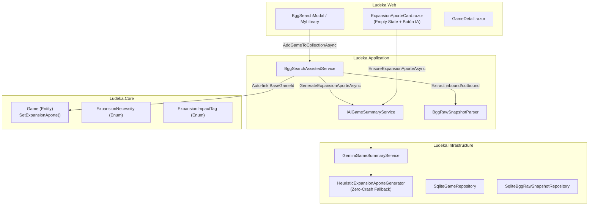

# Diseño Técnico — INC-102: Auto-vinculación Inmediata de Expansiones y Síntesis Asistida de Aporte con IA

## 1. Arquitectura de Componentes



## 2. Contratos y DTOs

### 2.1. `ExpansionAporteAiDto`
```csharp
namespace Ludeka.Application.DTOs;

public record ExpansionAporteAiDto(
    Guid ExpansionId,
    string WhatItBringsSummary,
    ExpansionNecessity Necessity,
    IReadOnlyList<ExpansionImpactTag> ImpactTags,
    int? ExtraPlayerCount = null,
    int? ExtraDurationMinutes = null,
    string Model = "Heurística Editorial",
    DateTime? GeneratedAt = null
);
```

### 2.2. Ampliación de `IAiGameSummaryService`
```csharp
Task<ExpansionAporteAiDto> GenerateExpansionAporteAsync(
    Game expansion, 
    Game? baseGame = null, 
    CancellationToken ct = default);

Task<ExpansionAporteAiDto> EnsureExpansionAporteAsync(
    Guid expansionId, 
    CancellationToken ct = default);
```

### 2.3. Entidad de Dominio `Game`
Se añade método de conveniencia para mutar el aporte editorial sin exigir recrear el `BaseGameId`:
```csharp
public void SetExpansionAporte(
    ExpansionNecessity necessity,
    IEnumerable<ExpansionImpactTag>? impactTags,
    string whatItBringsSummary,
    int? extraPlayerCount = null,
    int? extraDurationMinutes = null)
{
    ExpansionNecessity = necessity;
    ImpactTags.Clear();
    if (impactTags != null) ImpactTags.AddRange(impactTags);
    WhatItBringsSummary = whatItBringsSummary?.Trim();
    ExtraPlayerCount = extraPlayerCount;
    ExtraDurationMinutes = extraDurationMinutes;
}
```

## 3. Lógica de Auto-Vinculación Bidireccional (`BggSearchAssistedService`)

Se extrae y ejecuta un método auxiliar privado `TryAutoLinkBidirectionalAsync(Game game, CancellationToken ct)`:
1. **Caso Expansión (`game.Type == GameType.Expansion`):**
   - Si `game.BaseGameId == null` y `_snapshotRepo != null`:
     - Consultar snapshot crudo por `game.BggId`.
     - Extraer `inboundBaseBggId = BggRawSnapshotParser.ExtractInboundBaseGameBggIdFromJson(snapshot.RawJson)`.
     - Si existe y es positivo, buscar en catálogo: `var baseGame = await _gameRepo.GetByBggIdAsync(inboundBaseBggId.Value, ct)`.
     - Si se encuentra: `game.SetBaseGameId(baseGame.Id)`.
2. **Caso Juego Base (`game.Type == GameType.BaseGame`):**
   - Si `_snapshotRepo != null`:
     - Consultar snapshot crudo por `game.BggId`.
     - Extraer `outboundLinks = BggRawSnapshotParser.ExtractOutboundExpansionLinksFromJson(snapshot.RawJson)`.
     - Buscar en catálogo los títulos correspondientes: `var existingChildren = await _gameRepo.GetByBggIdsAsync(outboundIds, ct)`.
     - Para cada título hijo huérfano (`child.BaseGameId == null`):
       - `child.SetBaseGameId(game.Id)`.
       - `await _gameRepo.UpdateAsync(child, ct)`.

## 4. Generador Heurístico de Aportes (`HeuristicExpansionAporteGenerator`)

Para garantizar robustez total en entornos sin conectividad a Gemini o durante pruebas:
- **`Necessity`**: evaluada en función de la calificación BGG relativa y términos clave en la descripción ("esencial", "imprescindible", "must-have" -> `MustHave`; "rebalancea", "arregla", "modular" -> `HighlyRecommended`; por defecto -> `Situational`).
- **`ImpactTags`**:
  - Detección de `AddsPlayers`: si `expansion.MaxPlayers > baseGame.MaxPlayers` o descripción contiene "5-6 jugadores", "más jugadores".
  - Detección de `AddsSoloMode`: si `isSolo` o descripción contiene "solitario" / "solo mode".
  - Detección de `ModularContent`: si contiene "módulos", "modular", "variantes".
  - Detección de `AddsAsymmetry`: si contiene "asimetría", "facciones", "habilidades únicas".
- **`WhatItBringsSummary`**: síntesis estructurada basada en los componentes y estilo editorial del título.

## 5. Diseño de Interfaz (`ExpansionAporteCard.razor`)

- **Estado con Datos:** Mantiene la tarjeta existente con chips, veredicto y métricas de impacto.
- **Estado Vacío (*Empty State*):**
  - Contenedor con borde discontinuo suave (`border-dashed border-[var(--border-subtle)]`).
  - Icono central Lucide `sparkles` o `puzzle`.
  - Título: *"Aporte al juego base pendiente de veredicto"*
  - Párrafo explicativo: *"Esta expansión oficial aún no cuenta con un resumen editorial sobre las mecánicas, cambios de ritmo y valor añadido que aporta a la mesa."*
  - Botón: *"✨ Generar Aporte con IA"* (disponible para moderadores y administradores, o visible con retroalimentación inmediata).
