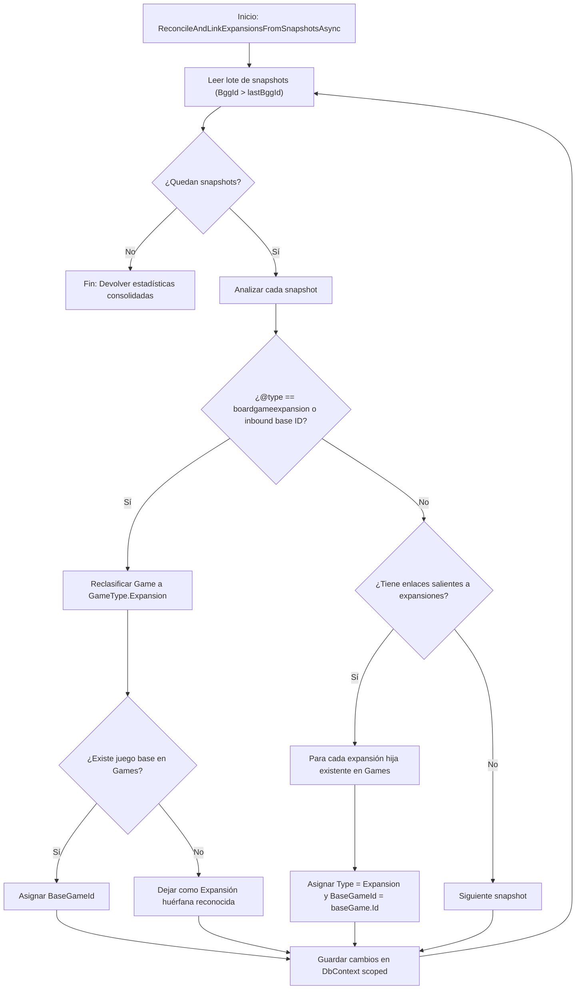

# Diseño Técnico: Reclasificación y Vinculación Masiva de Expansiones desde Snapshots BGG (INC-99)

## 1. Arquitectura de Componentes

### 1.1 `BggRawSnapshotSyncService` y Contratos
Se incorporan en `IBggRawSnapshotSyncService`:
```csharp
Task<BggExpansionReconciliationResultDto> ReconcileAndLinkExpansionsFromSnapshotsAsync(
    int batchSize = 200,
    CancellationToken ct = default);

Task<BggExpansionReconciliationResultDto> RunScheduledReconcileAndLinkExpansionsFromSnapshotsAsync(
    int batchSize = 200,
    CancellationToken ct = default);
```

DTO de resultado:
```csharp
public sealed record BggExpansionReconciliationResultDto(
    int TotalEvaluated,
    int ReclassifiedExpansionsCount,
    int LinkedExpansionsCount,
    IReadOnlyList<string> ReclassifiedTitles,
    IReadOnlyList<string> LinkedTitles,
    string Message
);
```

### 1.2 Métodos de Apoyo en `IBggRawSnapshotRepository` y Repositorios
Para iterar de forma eficiente por los 17.464 snapshots:
```csharp
Task<IReadOnlyList<BggRawSnapshot>> GetPagedSnapshotsAsync(int skip, int take, CancellationToken ct = default);
```
O cursor-based por `BggId`:
```csharp
Task<IReadOnlyList<BggRawSnapshot>> GetSnapshotsAfterBggIdAsync(int lastBggId, int take, CancellationToken ct = default);
```
`GetSnapshotsAfterBggIdAsync` es O(1) con índice sobre la clave primaria `BggId`, lo que garantiza estabilidad de memoria y velocidad óptima en SQLite y PostgreSQL.

### 1.3 Extracción de Metadatos de Expansión desde JSON
En `BggRawSnapshotSyncService`:
- `IsExpansionTypeFromJson(string rawJson)`: Comprueba si `@type` es `"boardgameexpansion"`.
- `ExtractInboundBaseGameBggIdFromJson(string rawJson)`: Ya existente, extrae el `id` base cuando `@inbound="true"`.
- `ExtractOutboundExpansionLinksFromJson(string rawJson)`: Ya existente, extrae la lista de identificadores hijas.

### 1.4 Algoritmo de Reconciliación por Lote
```
1. lastBggId = 0
2. Bucle mientras haya snapshots:
   a. Obtener bloque de N snapshots donde BggId > lastBggId ordenado por BggId.
   b. Si bloque vacío: finalizar.
   c. Recopilar todos los BggIds del bloque y los BaseBggIds referenciados.
   d. Cargar en memoria las entidades Game correspondientes mediante DbContext scoped.
   e. Para cada snapshot:
      - Si es expansión (por @type o enlace inbound):
        - Localizar expGame. Si expGame.Type != GameType.Expansion:
          - Reclasificar a GameType.Expansion.
          - Incrementar ReclassifiedCount.
        - Si tiene baseBggId y baseGame existe en catálogo:
          - Si expGame.BaseGameId != baseGame.Id:
            - expGame.SetBaseGameId(baseGame.Id).
            - Incrementar LinkedCount.
      - Si es juego base con enlaces salientes:
        - Para cada outboundId referenciado:
          - Localizar childGame. Si existe:
            - Si childGame.BaseGameId == null:
              - childGame.SetBaseGameId(baseGame.Id).
              - Incrementar LinkedCount y ReclassifiedCount si su Type era BaseGame.
   f. SaveChangesAsync en el scope.
   g. lastBggId = bloque.Last().BggId.
```

### 1.5 Corrección en `BggMassIngestionService.PromoteReadyToCatalogBatchAsync`
Antes de crear `new Game(...)`:
```csharp
var snapshot = await _snapshotRepo.GetByBggIdAsync(item.BggId, ct);
bool isExpansion = snapshot != null && BggRawSnapshotSyncService.IsExpansionTypeFromJson(snapshot.RawJson);
Guid? baseGameId = null;

if (isExpansion && snapshot != null)
{
    int? baseBggId = BggRawSnapshotSyncService.ExtractInboundBaseGameBggIdFromJson(snapshot.RawJson);
    if (baseBggId.HasValue)
    {
        var baseGame = await _gameRepo.GetByBggIdAsync(baseBggId.Value, ct);
        if (baseGame != null)
        {
            baseGameId = baseGame.Id;
        }
    }
}

var newGame = new Game(
    ...
    type: isExpansion ? GameType.Expansion : GameType.BaseGame,
    baseGameId: baseGameId,
    ...
);
```

### 1.6 Desglose de Métricas de Fallidos en Staging
En `BggStagingMetricsDto`:
```csharp
public sealed record BggStagingMetricsDto(
    int TotalInStaging,
    int PendingFetchCount,
    int FetchedCount,
    int PendingImagesCount,
    int ImagesCompletedCount,
    int PendingAiCount,
    int AiCompletedCount,
    int AiQuotaExceededCount,
    int PendingPromotionCount,
    int PromotedCount,
    int FailedCount,
    int UnpromotedFailedCount = 0
);
```
En `SqliteBggCatalogStagingRepository.GetMetricsAsync`:
- `UnpromotedFailedCount`: Conteo de registros con `PromotionStatus != StagingPromotionStatus.Promoted` y al menos un estado en `Failed`. Corresponde a los ~210 títulos bloqueados.

---

## 2. Diagrama de Flujo de Reconciliación


