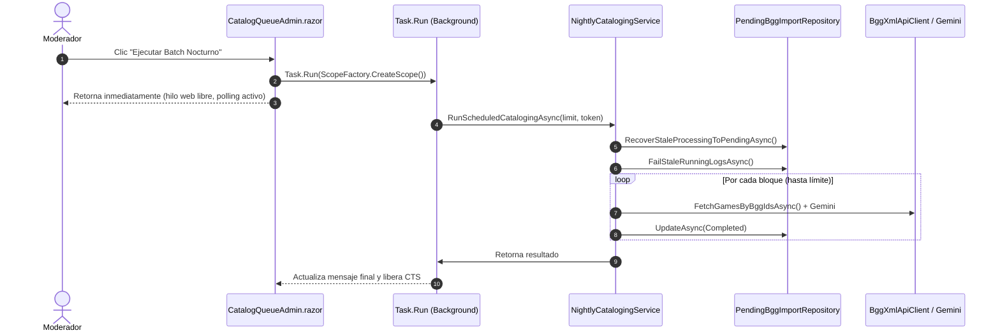

# Diseño Técnico: Desacoplo en Segundo Plano del Batch Nocturno y Auto-Recuperación de Bloqueos en Cola

## 1. Arquitectura de Componentes

### 1.1. Capa de Aplicación e Infraestructura
1. **`IPendingBggImportRepository` & `SqlitePendingBggImportRepository`:**
   - Adición del método `Task<int> RecoverStaleProcessingToPendingAsync(CancellationToken ct = default);`.
   - Consulta: `scope.Context.PendingBggImports.Where(p => p.Status == CatalogQueueStatus.Processing)`.
   - Aplica `item.ResetToPending()` y guarda cambios mediante `SaveChangesAsync(ct)`.
2. **`INightlyCatalogingLogRepository` & `SqliteNightlyCatalogingLogRepository`:**
   - Adición del método `Task<int> FailStaleRunningLogsAsync(DateTimeOffset startedBefore, CancellationToken ct = default);`.
   - Marca los logs anteriores con `Status = "Failed"` y mensaje de interrupción por timeout.
3. **`NightlyCatalogingService.RunScheduledCatalogingAsync`:**
   - En el pre-vuelo (antes de crear el nuevo log):
     - `await _pendingRepo.RecoverStaleProcessingToPendingAsync(ct);`
     - `await _logRepo.FailStaleRunningLogsAsync(startedAt, ct);`
   - Esto asegura que cualquier ejecución previa rota no ensucie las métricas ni retenga bloqueos sobre la cola.

### 1.2. Capa Web y Presentación (Blazor Interactive Server)
1. **Patrón de Desacoplo en `CatalogQueueAdmin.razor`:**
   - Atributos estáticos de estado:
     - `private static CancellationTokenSource? _nightlyBatchCts;`
     - `private static bool _isNightlyBatchActive => _nightlyBatchCts != null && !_nightlyBatchCts.IsCancellationRequested;`
     - `private static string? _nightlyBatchMessage;`
     - `private int _customBatchLimit = 400;`
   - Al pulsar «Ejecutar Batch Nocturno»:
     - Se inicializa `_nightlyBatchCts = new CancellationTokenSource()`.
     - Se lanza `_ = Task.Run(async () => { ... using var scope = ScopeFactory.CreateScope(); ... })`.
     - Se invoca `StartPollingTimer()` para refrescar reactivamente el log y el estado cada 2 segundos.
   - Al pulsar «Detener Batch Nocturno»:
     - Se solicita cancelación a `_nightlyBatchCts.Cancel()`.

## 2. Diagrama de Secuencia

