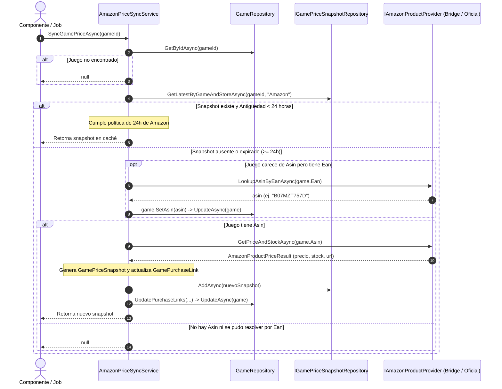

# Diseño Técnico INC-111: Arquitectura de Proveedores de Precios de Amazon, Mapeo EAN-ASIN y Caché (< 24h)

## 1. Diagrama de Arquitectura y Flujo de Interacción



---

## 2. Contratos e Interfaces

### 2.1. Dominio (`Ludeka.Core`)
En [`Game.cs`](file:///src/Ludeka.Core/Entities/Game.cs):
```csharp
public string? Asin { get; private set; }

public void SetAsin(string? asin)
{
    var normalized = string.IsNullOrWhiteSpace(asin) ? null : asin.Trim().ToUpperInvariant();
    if (normalized != null && normalized.Length > 20)
    {
        normalized = normalized[..20];
    }
    Asin = normalized;
}
```

### 2.2. DTOs y Contratos de Aplicación (`Ludeka.Application`)
En `Ludeka.Application/DTOs/AmazonProductPriceResult.cs`:
```csharp
namespace Ludeka.Application.DTOs;

public record AmazonProductPriceResult(
    string Asin,
    decimal Price,
    string Currency = "€",
    bool InStock = true,
    string? Title = null,
    string? ProductUrl = null,
    DateTimeOffset? FetchedAtUtc = null
)
{
    public DateTimeOffset FetchedAtUtc { get; init; } = FetchedAtUtc ?? DateTimeOffset.UtcNow;
}
```

En `Ludeka.Application/Interfaces/IAmazonProductProvider.cs`:
```csharp
namespace Ludeka.Application.Interfaces;

public interface IAmazonProductProvider
{
    Task<string?> LookupAsinByEanAsync(string ean, CancellationToken ct = default);
    Task<AmazonProductPriceResult?> GetPriceAndStockAsync(string asin, CancellationToken ct = default);
}
```

En `Ludeka.Application/Services/IAmazonPriceSyncService.cs`:
```csharp
namespace Ludeka.Application.Services;

public interface IAmazonPriceSyncService
{
    Task<GamePriceSnapshot?> SyncGamePriceAsync(Guid gameId, CancellationToken ct = default);
}
```

---

## 3. Implementaciones de Infraestructura (`Ludeka.Infrastructure`)

### 3.1. Configuración POCO (`AmazonOptions.cs`)
```csharp
namespace Ludeka.Infrastructure.Affiliates.Amazon;

public class AmazonOptions
{
    public const string SectionName = "Amazon";

    public string Provider { get; set; } = "None"; // "Bridge", "Official", "None"
    public string AssociateTag { get; set; } = "ludeka-21";
    public string DomainMatch { get; set; } = "amazon.es";
    public AmazonBridgeOptions Bridge { get; set; } = new();
    public AmazonPaApiOptions PaApi { get; set; } = new();
}

public class AmazonBridgeOptions
{
    public string ApiKey { get; set; } = string.Empty;
    public string BaseUrl { get; set; } = "https://api.rainforestapi.com";
    public string AmazonDomain { get; set; } = "amazon.es";
}

public class AmazonPaApiOptions
{
    public string AccessKey { get; set; } = string.Empty;
    public string SecretKey { get; set; } = string.Empty;
    public string AssociateTag { get; set; } = "ludeka-21";
    public string Region { get; set; } = "eu-west-1";
    public string Host { get; set; } = "webservices.amazon.es";
}
```

### 3.2. Proveedor Puente: `RainforestAmazonProductProvider.cs`
- Consume el endpoint HTTP de Rainforest API:
  - Búsqueda por EAN: `GET /request?api_key={ApiKey}&type=search&search_term={ean}&amazon_domain={AmazonDomain}`.
    - Extrae el primer resultado (`search_results[0].asin`).
  - Producto por ASIN: `GET /request?api_key={ApiKey}&type=product&asin={asin}&amazon_domain={AmazonDomain}`.
    - Extrae precio (`product.buybox_winner.price.value`), disponibilidad (`product.buybox_winner.availability.raw`), título y enlace canónico.
- Control de resiliencia: Si `ApiKey` está vacía o el servidor responde 4xx/5xx, devuelve `null` sin propagar excepción fatal.

### 3.3. Proveedor Oficial: `OfficialAmazonPaApiProvider.cs`
- Contiene la estructura de serialización para PA-API 5.0 (`SearchItems` y `GetItems`).
- Valida si `AccessKey` y `SecretKey` están presentes. Si no lo están, registra log defensivo y retorna `null`.
- Incluye el calculador de firma AWS SigV4 (HMAC-SHA256) estándar para llamadas REST a `webservices.amazon.es/paapi5/getitems`.

### 3.4. Orquestador de Sincronización y Caché: `AmazonPriceSyncService.cs`
- Inyecta `IGameRepository`, `IGamePriceSnapshotRepository`, `IAmazonProductProvider`, `IOptions<AmazonOptions>`, `ILogger<AmazonPriceSyncService>`.
- Aplica el algoritmo de 4 fases definido en la especificación.
- Asegura que la URL de afiliado inyecte el tag configurado (`ludeka-21`) usando la lógica canónica de enlaces de compra.

---

## 4. Persistencia y Migración de Base de Datos

### 4.1. SQLite (`SqliteGameRepository.cs`)
- En el método de inicialización / creación de tablas, añadir migración defensiva:
```csharp
// Añadir columna Asin si no existe
using var pragmaCmd = connection.CreateCommand();
pragmaCmd.CommandText = "PRAGMA table_info(Games);";
using var reader = await pragmaCmd.ExecuteReaderAsync();
bool hasAsin = false;
while (await reader.ReadAsync())
{
    if (reader.GetString(1).Equals("Asin", StringComparison.OrdinalIgnoreCase))
    {
        hasAsin = true;
        break;
    }
}
if (!hasAsin)
{
    using var alterCmd = connection.CreateCommand();
    alterCmd.CommandText = "ALTER TABLE Games ADD COLUMN Asin TEXT NULL;";
    await alterCmd.ExecuteNonQueryAsync();
}
```
- Actualizar `MapGameFromReader`, sentencia `INSERT INTO Games` y `UPDATE Games` para persistir y leer `Asin`.

### 4.2. PostgreSQL (`LudekaDbContext.cs`)
- Añadir en el mapeo de `Game`:
```csharp
builder.Property(g => g.Asin)
    .HasMaxLength(20)
    .IsRequired(false);
```

---

## 5. Registro en Inyección de Dependencias
En `ServiceCollectionExtensions.cs`:
```csharp
services.Configure<AmazonOptions>(configuration.GetSection(AmazonOptions.SectionName));

// Registro del proveedor según configuración
services.AddHttpClient<RainforestAmazonProductProvider>();
services.AddHttpClient<OfficialAmazonPaApiProvider>();

services.AddScoped<IAmazonProductProvider>(sp =>
{
    var opts = sp.GetRequiredService<IOptions<AmazonOptions>>().Value;
    return opts.Provider?.ToLowerInvariant() switch
    {
        "bridge" => sp.GetRequiredService<RainforestAmazonProductProvider>(),
        "official" => sp.GetRequiredService<OfficialAmazonPaApiProvider>(),
        _ => new NullAmazonProductProvider()
    };
});

services.AddScoped<IAmazonPriceSyncService, AmazonPriceSyncService>();
```
