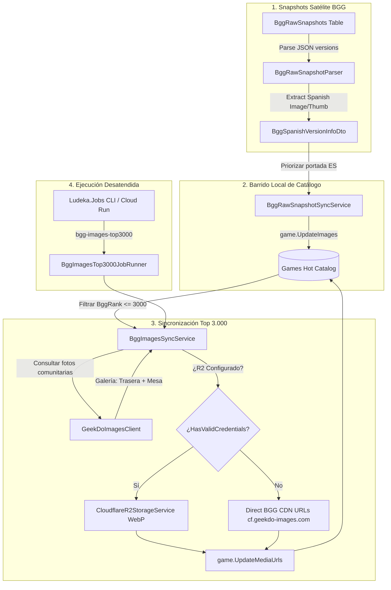

# Diseño Técnico: INC-120 Extracción de Portadas en Español desde Snapshots y Sincronización de Imágenes Comunitarias Top 3.000 BGG

## 1. Arquitectura General y Flujo de Datos



---

## 2. Contratos y DTOs

### 2.1 Ampliación de `BggSpanishVersionInfoDto`
En `src/Ludeka.Application/DTOs/BggVersionDtos.cs`:
```csharp
public record BggSpanishVersionInfoDto(
    string? Title,
    string? Publisher,
    int? YearPublished,
    string? Ean,
    string? ProductCode,
    string? CoverImageUrl = null,
    string? ThumbnailUrl = null
);
```

### 2.2 Contrato `IBggImagesSyncService`
En `src/Ludeka.Application/Contracts/IBggImagesSyncService.cs`:
```csharp
namespace Ludeka.Application.Contracts;

public interface IBggImagesSyncService
{
    Task<BggImagesSyncResultDto> SyncTopRankedImagesBatchAsync(
        int batchSize = 25,
        int maxRank = 3000,
        int delayMs = 800,
        CancellationToken ct = default);
}
```

### 2.3 DTO de Resultado de Sincronización
En `src/Ludeka.Application/DTOs/BggImagesSyncDtos.cs`:
```csharp
namespace Ludeka.Application.DTOs;

public record BggImagesSyncResultDto(
    int EvaluatedCount,
    int UpdatedCount,
    int SkippedCount,
    int FailedCount,
    int LastRankProcessed,
    bool HasMore,
    string Message
);
```

---

## 3. Lógica de Extracción y Fusión en `BggRawSnapshotParser`

### 3.1 Extracción en `ParseVersionInfo`
```csharp
string? coverImageUrl = NormalizeUrl(ExtractStringValue(versionElem, "image"));
string? thumbnailUrl = NormalizeUrl(ExtractStringValue(versionElem, "thumbnail"));

private static string? NormalizeUrl(string? url)
{
    if (string.IsNullOrWhiteSpace(url)) return null;
    url = url.Trim();
    if (url.StartsWith("//")) return "https:" + url;
    return url;
}
```

### 3.2 Enriquecimiento de Candidatas
Si la candidata con mejor EAN no tiene `CoverImageUrl`, pero otra versión en español sí lo tiene, se fusiona:
```csharp
if (string.IsNullOrWhiteSpace(best.CoverImageUrl))
{
    var withCover = spanishCandidates.Find(c => !string.IsNullOrWhiteSpace(c.CoverImageUrl));
    if (withCover != null)
    {
        best = best with { CoverImageUrl = withCover.CoverImageUrl, ThumbnailUrl = withCover.ThumbnailUrl };
    }
}
```

---

## 4. Orquestación del Top 3.000 en `BggImagesSyncService`

1. **Consulta Keyset:**
   Paginación sobre `Games` ordenando por `BggRank` ascendente (`g.BggRank != null && g.BggRank <= maxRank`), tomando bloques de tamaño `batchSize`.
2. **Evaluación de Necesidad de Actualización:**
   Un juego se actualiza si:
   - Carece de `BackCoverImageUrl` o `TableImageUrl`.
   - Su `CoverImageUrl` es nulo, vacío, o apunta a almacenamiento simulado roto (`.r2.dev/games/`).
   - El snapshot local de versiones dispone de una portada en español (`vInfo.CoverImageUrl`) y el juego aún conserva la internacional.
3. **Resolución de URLs:**
   - Portada frontal: Si hay portada en español en snapshot, se selecciona prioritariamente; si no, se usa la carátula comunitaria más votada de GeekDo (`gallery.FrontCoverUrl`) o la carátula internacional previa del juego.
   - Trasera: `gallery.BackCoverUrl`.
   - Mesa: `gallery.TableOrGameplayUrl`.
4. **Estrategia de Persistencia (R2 vs CDN Directo):**
   - Si `CloudflareR2Options.HasValidCredentials == true`: Se descarga el stream de cada imagen y se sube a R2 optimizado a WebP vía `IImageStorageService.UploadGameImageVariantsAsync`.
   - Si `HasValidCredentials == false`: Se asignan directamente las URLs canónicas devueltas por GeekDo/BGG (`https://cf.geekdo-images.com/...`), previniendo errores 404 por URLs simuladas.

---

## 5. Implementación del Runner en `Ludeka.Jobs`

- Se crea `BggImagesTop3000JobRunner : IJobRunner`.
- `Name => JobNames.BggImagesTop3000` (`"bgg-images-top3000"`).
- Ejecución en bucle dentro de `_coordinator.ExecuteWithWindowLeaseAsync` con latidos `heartbeat.BeatAsync(workCt)`.
- El bucle finaliza cuando `HasMore == false` o se alcanza el rango 3.000.
