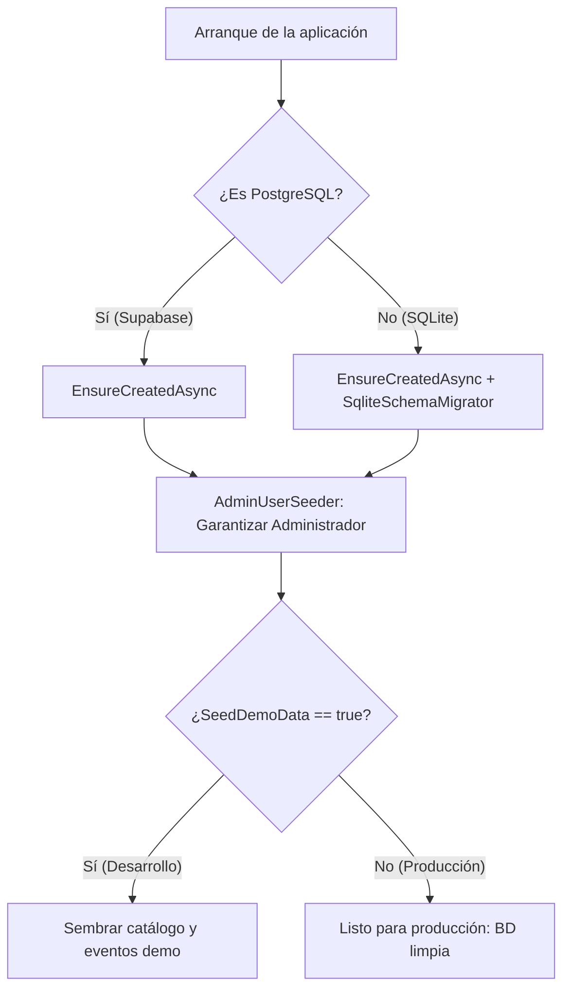

# Diseño Técnico: INC-38 — Persistencia PostgreSQL en Supabase, Estrategia Dual y Usuario Admin Inicial

## 1. Arquitectura de Configuración y Proveedores

### 1.1 Opciones de Configuración
```csharp
namespace Ludeka.Infrastructure.Options;

public class DatabaseOptions
{
    public const string SectionName = "Database";

    /// <summary>
    /// Proveedor de persistencia: "Sqlite" o "PostgreSql". Si está vacío, se autodetecta por la ConnectionString.
    /// </summary>
    public string? Provider { get; set; }

    /// <summary>
    /// Indica si deben sembrarse datos ficticios de demostración (catálogo inicial, eventos de prueba).
    /// En producción debe ser false.
    /// </summary>
    public bool SeedDemoData { get; set; } = false;
}

public class AdminUserOptions
{
    public const string SectionName = "AdminUser";

    public string Id { get; set; } = "admin-fundador";
    public string UserName { get; set; } = "Administrador Ludeka";
    public string Email { get; set; } = "admin@ludeka.es";
    public string? Country { get; set; } = "España";
}
```

### 1.2 Detección y Configuración en Inyección de Dependencias
En `Program.cs` o mediante método de extensión en `Ludeka.Infrastructure`:
```csharp
var dbOptions = builder.Configuration.GetSection(DatabaseOptions.SectionName).Get<DatabaseOptions>() ?? new DatabaseOptions();
var connectionString = builder.Configuration.GetConnectionString("DefaultConnection") 
    ?? builder.Configuration.GetConnectionString("PostgreSqlConnection")
    ?? "Data Source=ludeka.db";

bool isPostgreSql = string.Equals(dbOptions.Provider, "PostgreSql", StringComparison.OrdinalIgnoreCase)
    || connectionString.Contains("Host=", StringComparison.OrdinalIgnoreCase)
    || connectionString.Contains("supabase.co", StringComparison.OrdinalIgnoreCase)
    || connectionString.StartsWith("postgres://", StringComparison.OrdinalIgnoreCase)
    || connectionString.StartsWith("postgresql://", StringComparison.OrdinalIgnoreCase);

builder.Services.AddDbContext<LudekaDbContext>(options =>
{
    if (isPostgreSql)
    {
        options.UseNpgsql(connectionString, npgsqlOptions =>
        {
            npgsqlOptions.EnableRetryOnFailure(
                maxRetryCount: 3,
                maxRetryDelay: TimeSpan.FromSeconds(5),
                errorCodesToAdd: null);
        });
    }
    else
    {
        options.UseSqlite(connectionString);
    }
});
```

---

## 2. Inicialización de Esquema y Semillado Exclusivo de Admin

### 2.1 Flujo en el Arranque (`Program.cs`)


### 2.2 Sembrador del Administrador Inicial (`AdminUserSeeder`)
```csharp
namespace Ludeka.Infrastructure.Seeding;

public static class AdminUserSeeder
{
    public static async Task EnsureAdminUserAsync(
        LudekaDbContext db, 
        AdminUserOptions options, 
        CancellationToken ct = default)
    {
        // 1. Verificar si ya existe algún usuario del equipo fundador
        bool hasFoundingUser = await db.AppUsers
            .AnyAsync(u => u.Role == UserRole.FoundingTeam, ct);

        if (hasFoundingUser)
            return;

        // 2. Crear el usuario Administrador Fundador inicial garantizado
        var admin = new AppUser(
            id: string.IsNullOrWhiteSpace(options.Id) ? "admin-fundador" : options.Id,
            userName: string.IsNullOrWhiteSpace(options.UserName) ? "Administrador Ludeka" : options.UserName,
            email: string.IsNullOrWhiteSpace(options.Email) ? "admin@ludeka.es" : options.Email,
            role: UserRole.FoundingTeam,
            permissions: ModeratorPermission.All,
            status: UserStatus.Active,
            createdAt: DateTimeOffset.UtcNow,
            country: options.Country
        );

        await db.AppUsers.AddAsync(admin, ct);
        await db.SaveChangesAsync(ct);
    }
}
```

---

## 3. Mapeo EF Core y Compatibilidad PostgreSQL (`LudekaDbContext`)

- **Tipos JSON:** `b.ToJson()` es compatible con SQLite y PostgreSQL. En Npgsql se serializa en columnas tipo `jsonb`.
- **Colecciones primitivas:** `PrimitiveCollection(g => g.ImpactTags)` se mapea a array nativo `text[]` en PostgreSQL o JSON en SQLite.
- **Fechas y Horas:** `DateTimeOffset` se almacena como `timestamp with time zone`. Para evitar errores de tipo en Npgsql, todos los valores se normalizan a UTC (`DateTimeOffset.UtcNow`).
- **Claves primarias:** `Guid` se mapea a tipo nativo `uuid` en PostgreSQL y `TEXT` en SQLite.

---

## 4. Script SQL Canónico para Supabase (`docs/database/supabase_schema.sql`)

El script contendrá todas las sentencias DDL idempotentes (`CREATE TABLE IF NOT EXISTS`, `CREATE INDEX IF NOT EXISTS`) para permitir:
1. Crear la base de datos de producción desde cero ejecutando el script en el SQL Editor de Supabase.
2. Auditar la estructura y tipos de columnas sin depender de herramientas de línea de comandos.

---

## 5. Script de Copias de Seguridad (`scripts/supabase-backup.ps1`)

Parámetros:
- `ConnectionString` o variable `SUPABASE_DB_URL`: Conexión directa a Supabase.
- `OutputDirectory`: Carpeta de destino (predeterminada: `backups/`).
- `RetentionDays`: Días de antigüedad antes de depurar copias previas (predeterminado: 7).
- `Compress`: Generación de archivo `.sql.gz` utilizando las utilidades del sistema o .NET `GZipStream`.
