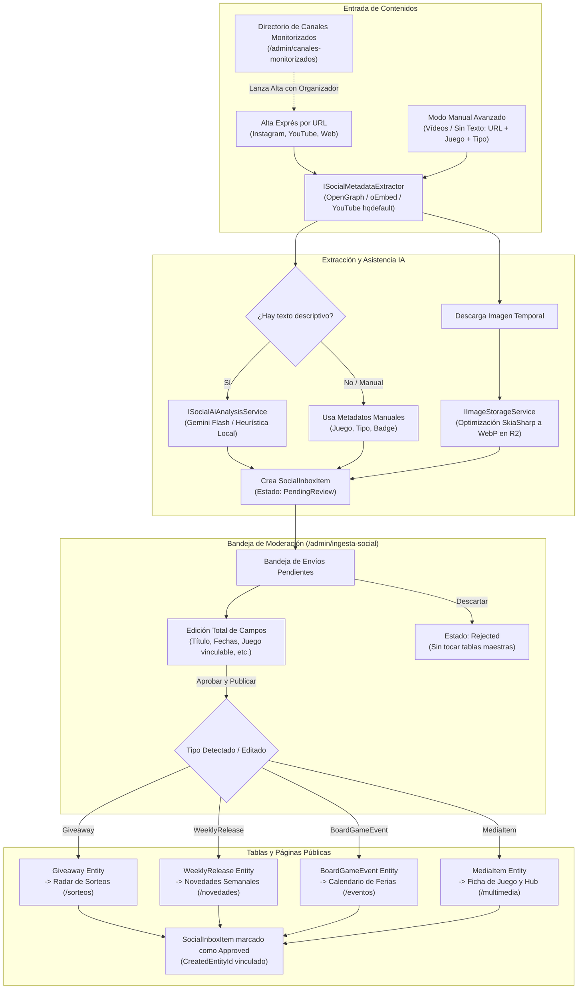

# Diseño Técnico: change-42-ingesta-social-moderacion (Incremento 42: Hub de Ingesta Social y Multimedia)

## 1. Diagrama de Flujo y Arquitectura del Sistema



---

## 2. Modelos de Dominio (`Ludeka.Core`)

### 2.1 Enums y Value Objects

```csharp
namespace Ludeka.Core.Enums;

public enum SocialInboxStatus
{
    PendingReview,
    Approved,
    Rejected
}

public enum SocialSubmissionType
{
    Giveaway,
    WeeklyRelease,
    BoardGameEvent,
    MediaItem
}

public enum SocialPlatform
{
    Instagram,
    YouTube,
    Web,
    TwitterX,
    TikTok
}

public enum MonitoredAccountType
{
    Publisher,
    Creator,
    Store,
    Community
}
```

### 2.2 Entidad `SocialInboxItem`

```csharp
namespace Ludeka.Core.Entities;

public class SocialInboxItem
{
    public Guid Id { get; private set; } = Guid.NewGuid();
    public string SourceUrl { get; private set; } = string.Empty;
    public SocialPlatform Platform { get; private set; } = SocialPlatform.Instagram;
    public SocialSubmissionType DetectedType { get; private set; } = SocialSubmissionType.Giveaway;
    public SocialInboxStatus Status { get; private set; } = SocialInboxStatus.PendingReview;

    // Metadatos editables por el moderador
    public string Title { get; private set; } = string.Empty;
    public string OrganizerOrAuthor { get; private set; } = string.Empty;
    public string? Collaborator { get; private set; }
    public Guid? GameId { get; private set; }
    public string? GameTitle { get; private set; }
    public DateTimeOffset? EventOrReleaseDate { get; private set; }
    public DateTimeOffset? EventEndDate { get; private set; }
    public string? Location { get; private set; }
    public decimal? EstimatedPvp { get; private set; }
    public MediaCategory? MediaCategory { get; private set; }
    public string? PlayerCountBadge { get; private set; }

    // Medios y texto de soporte
    public string? OriginalCaption { get; private set; }
    public string? ThumbnailUrl { get; private set; }
    public bool IsVideo { get; private set; }
    public string? AiAnalysisNotes { get; private set; }

    // Auditoría y ciclo de vida
    public Guid? CreatedEntityId { get; private set; }
    public string? ModeratorNotes { get; private set; }
    public DateTimeOffset CreatedAt { get; private set; } = DateTimeOffset.UtcNow;
    public DateTimeOffset? ReviewedAt { get; private set; }
    public string? ReviewedByUserId { get; private set; }

    public virtual Game? Game { get; private set; }

    // Constructores y métodos de mutación controlada:
    // UpdateDetails(...), Approve(Guid createdEntityId, string reviewerUserId), Reject(string reason, string reviewerUserId)
}
```

### 2.3 Entidad `MonitoredSocialAccount`

```csharp
namespace Ludeka.Core.Entities;

public class MonitoredSocialAccount
{
    public Guid Id { get; private set; } = Guid.NewGuid();
    public string Name { get; private set; } = string.Empty;
    public SocialPlatform Platform { get; private set; } = SocialPlatform.Instagram;
    public string HandleOrChannelId { get; private set; } = string.Empty;
    public MonitoredAccountType AccountType { get; private set; } = MonitoredAccountType.Publisher;
    public string ProfileUrl { get; private set; } = string.Empty;
    public bool IsEnabled { get; private set; } = true;
    public DateTimeOffset? LastCheckedAt { get; private set; }
    public string? Notes { get; private set; }
    public DateTimeOffset CreatedAt { get; private set; } = DateTimeOffset.UtcNow;
    public DateTimeOffset? UpdatedAt { get; private set; }
}
```

---

## 3. Capa de Aplicación (`Ludeka.Application`)

### 3.1 DTOs
- `SocialMetadataResultDto`: título extraído, autor, descripción/caption, URL de miniatura/cover, si es vídeo.
- `SocialAiAnalysisResultDto`: tipo detectado, título normalizado, organizador, juego sugerido, fecha clave, fecha fin, ubicación, precio estimado, categoría de medio y badge de comensales.
- `SocialInboxItemDto`: DTO de lectura completo para la bandeja.
- `SocialInboxManualInputDto`: DTO para modo manual avanzado (URL, Tipo, GameId opcional, Título, etc.).
- `SocialInboxUpdateDto`: DTO para actualización/edición de un ítem por el moderador.
- `MonitoredAccountDto`: DTO para visualización y gestión de cuentas monitorizadas.

### 3.2 Interfaces y Contratos
- `ISocialInboxRepository`:
  - `GetPendingAsync(SocialSubmissionType? typeFilter, CancellationToken ct)`
  - `GetAllAsync(SocialInboxStatus? statusFilter, SocialSubmissionType? typeFilter, int page, int pageSize, CancellationToken ct)`
  - `GetByIdAsync(Guid id, CancellationToken ct)`
  - `GetPendingCountAsync(CancellationToken ct)`
  - `AddAsync(SocialInboxItem item, CancellationToken ct)`
  - `UpdateAsync(SocialInboxItem item, CancellationToken ct)`
- `IMonitoredAccountRepository`:
  - `GetAllAsync(SocialPlatform? platform, MonitoredAccountType? type, bool? onlyEnabled, CancellationToken ct)`
  - `GetByIdAsync(Guid id, CancellationToken ct)`
  - `AddAsync(MonitoredSocialAccount account, CancellationToken ct)`
  - `UpdateAsync(MonitoredSocialAccount account, CancellationToken ct)`
  - `DeleteAsync(Guid id, CancellationToken ct)`
  - `ExistsAsync(SocialPlatform platform, string handleOrChannelId, CancellationToken ct)`
- `ISocialMetadataExtractor`:
  - `Task<SocialMetadataResultDto?> ExtractFromUrlAsync(string url, CancellationToken ct = default)`
- `ISocialAiAnalysisService`:
  - `Task<SocialAiAnalysisResultDto> AnalyzeTextAsync(string text, string authorOrChannel, CancellationToken ct = default)`
- `ISocialIngestionService`:
  - `Task<SocialInboxItemDto> IngestFromUrlAsync(string url, string? manualCaption = null, CancellationToken ct = default)`
  - `Task<SocialInboxItemDto> IngestManualAdvancedAsync(SocialInboxManualInputDto input, CancellationToken ct = default)`
  - `Task<SocialInboxItemDto> UpdateItemAsync(SocialInboxUpdateDto dto, CancellationToken ct = default)`
  - `Task<Guid> ApproveAndPublishAsync(Guid inboxItemId, string reviewerUserId, CancellationToken ct = default)`
  - `Task RejectItemAsync(Guid inboxItemId, string reason, string reviewerUserId, CancellationToken ct = default)`
- `IMonitoredAccountService`:
  - `Task<IReadOnlyList<MonitoredAccountDto>> GetAccountsAsync(SocialPlatform? platform = null, MonitoredAccountType? type = null, CancellationToken ct = default)`
  - `Task<MonitoredAccountDto> CreateAccountAsync(MonitoredAccountDto dto, CancellationToken ct = default)`
  - `Task ToggleAccountStatusAsync(Guid id, bool isEnabled, CancellationToken ct = default)`
  - `Task<int> SyncFromDirectoryAsync(CancellationToken ct = default)`

---

## 4. Capa de Infraestructura (`Ludeka.Infrastructure`)

### 4.1 Extractor OpenGraph & YouTube (`OpenGraphSocialMetadataExtractor`)
- Para YouTube: detecta patrón de URL (`youtu.be/{id}`, `youtube.com/watch?v={id}`), resuelve miniatura nativa `https://img.youtube.com/vi/{id}/hqdefault.jpg`, consulta oEmbed `https://www.youtube.com/oembed?url={url}&format=json` para obtener título y autor/canal.
- Para Instagram / Web: consulta HTTP respetuosa (`HttpClient`), parsea tags `<meta property="og:title">`, `<meta property="og:description">`, `<meta property="og:image">`. Si el HTML está ofuscado o requiere login, devuelve los datos parciales permitiendo que el moderador aporte el texto.

### 4.2 Servicio Gemini Flash (`GeminiSocialAnalysisService`)
- Si `GeminiOptions.ApiKey` está presente y `UseSimulatedMode == false`:
  - Realiza llamada REST a la API de Google Gemini (`gemini-2.5-flash` o `gemini-1.5-flash`) con formato JSON estructurado.
  - Prompt especializado en el léxico lúdico hispano: reconoce sorteos (bases, menciones, fechas límite), lanzamientos (editoriales, PVP), eventos (sedes, ferias) y contenidos audiovisuales.
- Si no hay API key o está en modo simulado:
  - Generador heurístico inteligente con regex para detectar fechas en español (ej. "hasta el 24 de octubre", "28/10", "del 10 al 12 de noviembre"), palabras clave ("sorteo", "participa", "lanzamiento", "novedad", "partida a 2", "tutorial") y nombres de editoriales/juegos conocidos.

### 4.3 Almacenamiento y Optimización de Miniaturas
- `ISocialIngestionService` invoca `IImageStorageService.UploadOptimizedImageAsync(...)`:
  - Descarga la imagen encontrada vía `HttpClient`.
  - La procesa en memoria a WebP (máximo 1000px ancho, 82% calidad).
  - Almacena bajo `social-inbox/{inboxItemId}/cover.webp`.

### 4.4 Repositorios EF Core / SQLite
- `SqliteSocialInboxRepository` y `SqliteMonitoredAccountRepository` implementan sus contratos.
- En `LudekaDbContext`:
  - `DbSet<SocialInboxItem> SocialInboxItems`
  - `DbSet<MonitoredSocialAccount> MonitoredSocialAccounts`
  - Mapeos de claves foráneas opcionales con `Game`.
- Soporte en `SqliteSchemaMigrator` para crear tablas si no existen en SQLite local.

---

## 5. Capa Web Blazor (`Ludeka.Web`)

### 5.1 Componentes Razor
1. `SocialInboxModeration.razor` (`/admin/ingesta-social`):
   - Pestañas con contadores de pendientes (`Todos`, `Sorteos`, `Novedades`, `Eventos`, `Vídeos`).
   - Botón destacado `[ ⚡ Alta Exprés por URL ]`.
   - Grid/Lista de ítems con tarjeta visual, fecha relativa, badges y acciones:
     - `[ ✏️ Editar ]` -> Abre modal de edición.
     - `[ ✅ Aprobar y Publicar ]` -> Confirmación y publicación inmediata.
     - `[ ✕ Descartar ]` -> Diálogo de confirmación con motivo.
2. `SocialInboxEditModal.razor`:
   - Modal interactivo para modificar cualquier campo del ítem:
     - Título, Organizador/Canal, Colaborador.
     - Selector de tipo de destino (`Sorteo`, `Novedad`, `Evento`, `Vídeo`).
     - Selector con buscador reactivo de juegos del catálogo (`ICatalogService.SearchAsync`).
     - Fechas (límite / inicio / fin).
     - Campos específicos según tipo (Ubicación para eventos, PVP para novedades, Badge de jugadores para vídeos).
3. `SocialExpressIngestModal.razor`:
   - Modal con 2 pestañas:
     - **Pestaña 1: "⚡ Pegar URL y Listo"**: campo de URL + texto opcional del post.
     - **Pestaña 2: "🛠️ Modo Manual Avanzado"**: URL + tipo + juego + categoría.
4. `MonitoredAccountsDirectory.razor` (`/admin/canales-monitorizados`):
   - Listado con filtros por plataforma y tipo.
   - Botón `[ 🔄 Sincronizar desde Directorio ]` (trae perfiles de `Publisher`, `Creator`, `Store`).
   - Botón `[ ➕ Nueva Cuenta ]`.
   - Enlace "Visitar" y acción "Añadir Publicación".
