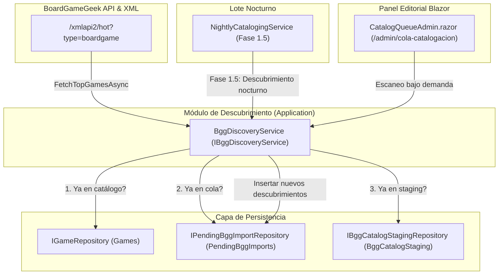

# Diseño Técnico — INC-43: Ingesta Continua y Auto-Descubrimiento de Novedades BGG en el Lote Nocturno

## 1. Arquitectura y Componentes



## 2. Definición de Contratos y Modelos

### 2.1 Ampliación de `CatalogQueueOrigin` (`Ludeka.Core.Enums`)
```csharp
public enum CatalogQueueOrigin
{
    UserImport = 0,
    NewsDiscovery = 1,
    TopBggBackfill = 2,
    BggNewReleases = 3,
    BggHotness = 4
}
```

### 2.2 DTOs de Descubrimiento (`Ludeka.Application.DTOs`)
```csharp
public record BggDiscoveryResultDto(
    int TotalScanned,
    int DiscoveredCount,
    int EnqueuedCount,
    int AlreadyCatalogedCount,
    int AlreadyInQueueCount,
    IReadOnlyList<string> EnqueuedTitles
);
```

### 2.3 Contrato de Servicio (`Ludeka.Application.Contracts.IBggDiscoveryService`)
```csharp
public interface IBggDiscoveryService
{
    Task<BggDiscoveryResultDto> DiscoverAndEnqueueBggTrendsAsync(int maxItems = 50, CancellationToken ct = default);
    Task<BggDiscoveryResultDto> DiscoverAndEnqueueNewReleasesAsync(int? targetYear = null, int maxItems = 50, CancellationToken ct = default);
}
```

### 2.4 Actualización de `NightlyCatalogingExecutionLog` y DTOs
- Agregar `BggDiscoveryCount` a `NightlyCatalogingExecutionLog`.
- Actualizar `Complete(...)` para recibir `bggDiscoveryCount`.
- Actualizar `NightlyCatalogingResultDto` para exponer `BggDiscoveryCount`.

### 2.5 Actualización de `NightlyCatalogingService`
- Inyección de `IBggDiscoveryService? _bggDiscoveryService`.
- Nueva fase `1.5` entre la Fase 1 (novedades editoriales) y la Fase 2 (procesamiento de cola prioritaria).
- Encolado previo de las tendencias de BGG para que, si hay cupo disponible, puedan catalogarse en esa misma noche.

## 3. UI y Componentes Razor (`CatalogQueueAdmin.razor`)
- Acción de administración: botón *"Escanear Novedades BGG"* con indicador de carga e icono Lucide `<Icon Name="TrendingUp" />`.
- Filtro por origen con los nuevos tipos:
  - `BggNewReleases`: "Novedades BGG"
  - `BggHotness`: "Tendencia BGG"
- Badges visuales editoriales sin emojis:
  - Novedades BGG: `bg-amber-500/10 text-amber-300 border border-amber-500/30`
  - Tendencias Hotness: `bg-rose-500/10 text-rose-300 border border-rose-500/30`
- Cuadro de resultados emergente o toast con el detalle del escaneo.
