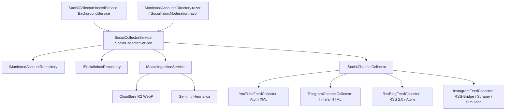

# Diseño Técnico — INC-44: Worker de Recolección Multicanal Automática (YouTube RSS, Telegram, Feeds de Editoriales e Instagram)

## 1. Arquitectura de Componentes y Contratos



## 2. Definición de Contratos

### 2.1. `ISocialChannelCollector`
```csharp
public interface ISocialChannelCollector
{
    bool CanHandle(SocialPlatform platform);
    Task<IReadOnlyList<DiscoveredSocialPostDto>> CollectRecentPostsAsync(
        MonitoredSocialAccount account,
        int maxItems = 5,
        CancellationToken ct = default);
}
```

### 2.2. `ISocialCollectorService`
```csharp
public interface ISocialCollectorService
{
    Task<SocialCollectorRunResultDto> CollectAllAccountsAsync(int maxItemsPerAccount = 5, CancellationToken ct = default);
    Task<SocialCollectorRunResultDto> CollectAccountAsync(Guid accountId, int maxItems = 5, CancellationToken ct = default);
}
```

### 2.3. Modelado de Opciones (`SocialCollectorOptions`)
```csharp
public class SocialCollectorOptions
{
    public const string SectionName = "SocialCollector";
    public bool Enabled { get; set; } = true;
    public int IntervalMinutes { get; set; } = 120;
    public int MaxItemsPerAccount { get; set; } = 5;
    public int InitialDelaySeconds { get; set; } = 30;
    public bool Simulate { get; set; } = false;
    public string? RssBridgeUrlTemplate { get; set; }
    public int MaxPostAgeDays { get; set; } = 14;
    public bool YouTubeEnabled { get; set; } = true;
    public bool TelegramEnabled { get; set; } = true;
    public bool RssBlogEnabled { get; set; } = true;
    public bool InstagramEnabled { get; set; } = true;
}
```
