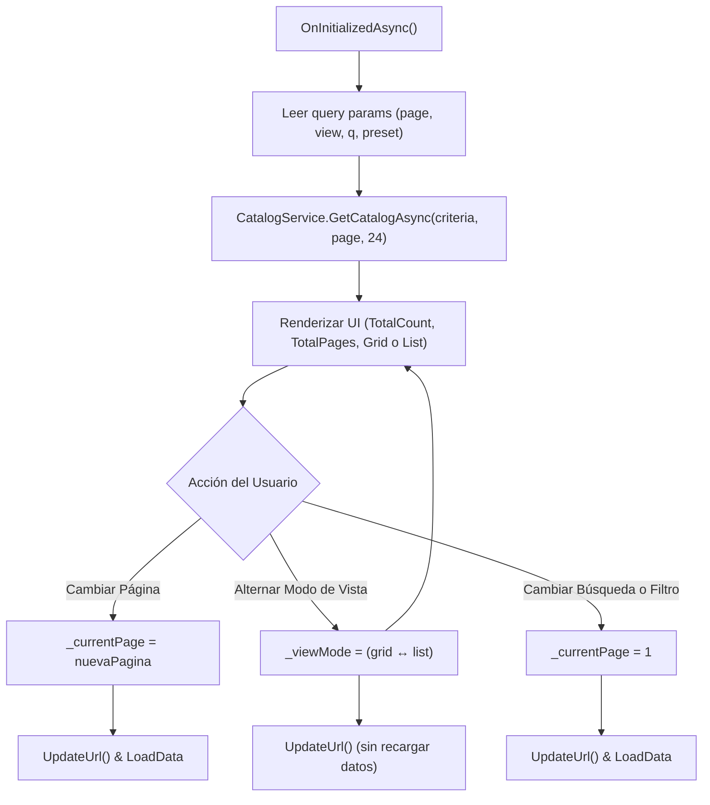

# Diseño Técnico de Arquitectura — INC-58: Paginación Real del Catálogo y Modos de Vista

## 1. Arquitectura de Componentes

### 1.1 Modificación en `ICatalogService.cs`
`CatalogResult` se amplía con la propiedad calculada de solo lectura:
```csharp
public record CatalogResult(IReadOnlyList<GameSummaryDto> Games, int TotalCount, int Page, int PageSize)
{
    public int TotalPages => PageSize > 0 ? (int)Math.Ceiling((double)TotalCount / PageSize) : 0;
}
```

### 1.2 Catálogo Whitelist de Iconos en `IconCatalog.cs`
Se incorporan los iconos oficiales de Lucide (v0.525.0):
- `layout-grid`:
  ```xml
  <rect width="7" height="7" x="3" y="3" rx="1" /><rect width="7" height="7" x="14" y="3" rx="1" /><rect width="7" height="7" x="14" y="14" rx="1" /><rect width="7" height="7" x="3" y="14" rx="1" />
  ```
- `list`:
  ```xml
  <line x1="8" x2="21" y1="6" y2="6" /><line x1="8" x2="21" y1="12" y2="12" /><line x1="8" x2="21" y1="18" y2="18" /><line x1="3" x2="3.01" y1="6" y2="6" /><line x1="3" x2="3.01" y1="12" y2="12" /><line x1="3" x2="3.01" y1="18" y2="18" />
  ```

### 1.3 Nuevo Componente `GameListItem.razor`
Ubicación: `src/Ludeka.Web/Components/Shared/GameListItem.razor`.
- Recibe `[Parameter, EditorRequired] public GameSummaryDto Game { get; set; } = null!;`.
- Estructura horizontal:
  - Carátula 64x64px en `ThumbnailUrl` (WebP optimizado) con `width="64"` y `height="64"`.
  - Título en español enlazado a `/juegos/{slug}`, título original si difiere.
  - Diseñador &bull; Editorial.
  - Badges informativos: número de jugadores, duración en minutos, huella de mesa (`SmallTable` -> Mesa pequeña, `StandardTable` -> Mesa estándar, `TableMonster` -> Monstruo de mesa), tipo de juego (Base vs Expansión).
  - Puntuación BGG/Ludeka flotante a la derecha con badge consistente.
  - Hover editorial con microinteracciones sutiles en `var(--brand-primary)`.

### 1.4 Refactorización de `Home.razor`
- Estado interno:
  - `_currentPage = 1;`
  - `_pageSize = 24;`
  - `_viewMode = "grid";` (`"grid"` | `"list"`)
  - `_totalCount = 0;`
  - `_totalPages = 0;`
- Ciclo de vida:
  - `OnInitializedAsync`: extrae `page` (parseado de forma segura a int >= 1), `view` (`list` o `grid`), `q` y presets.
  - `UpdateUrl`: compone la URL con `QueryHelpers.AddQueryString` y ejecuta `Navigation.NavigateTo(url, replace: true)` sin forzar re-renderizado destructivo.
  - `GoToPage(int page)`: actualiza `_currentPage`, actualiza URL y carga el catálogo.
  - `SetViewMode(string mode)`: actualiza `_viewMode`, actualiza URL sin recargar el catálogo de backend.
  - `SetPreset` / `OnSearchChanged`: resetea `_currentPage = 1`, actualiza URL y recarga catálogo.

---

## 2. Diagrama de Flujo de Navegación y Estado


