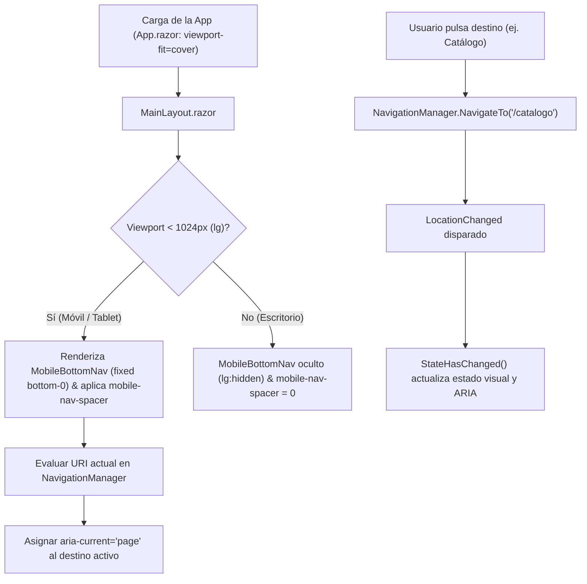

# Diseño Técnico de Arquitectura — INC-60: Navegación Móvil — Barra Inferior y Safe-Area

## 1. Arquitectura de Componentes

### 1.1 Viewport y Directivas de Sistema (`App.razor`)
Se actualiza la cabecera HTML para que los motores WebKit y Blink habiliten el cálculo de áreas seguras:
```html
<meta name="viewport" content="width=device-width, initial-scale=1.0, viewport-fit=cover" />
```

### 1.2 Reglas CSS de Safe-Area y Reserva de Espacio (`input.css` y `MainLayout.razor.css`)
En `src/Ludeka.Web/Styles/input.css`:
```css
/* Utilidades Safe-Area para Navegación Móvil (INC-60) */
.mobile-safe-bottom {
    padding-bottom: env(safe-area-inset-bottom, 0px);
}

.mobile-nav-spacer {
    padding-bottom: calc(4.25rem + env(safe-area-inset-bottom, 0px));
}

@media (min-width: 1024px) {
    .mobile-nav-spacer {
        padding-bottom: 0 !important;
    }
}
```

En `src/Ludeka.Web/Components/Layout/MainLayout.razor.css`:
```css
/* Ajuste de #blazor-error-ui para convivir con la barra inferior móvil */
#blazor-error-ui {
    bottom: calc(4.25rem + env(safe-area-inset-bottom, 0px));
}

@media (min-width: 1024px) {
    #blazor-error-ui {
        bottom: 0;
    }
}
```

### 1.3 Nuevo Componente `MobileBottomNav.razor`
Ubicación: `src/Ludeka.Web/Components/Shared/MobileBottomNav.razor`.
- **Inyecciones:**
  - `NavigationManager Navigation`
  - `ICurrentUserService CurrentUserService`
- **Marcado Estructural:**
  ```html
  <nav aria-label="Navegación principal móvil"
       class="fixed bottom-0 inset-x-0 z-40 bg-[var(--bg-nav)] backdrop-blur-md border-t border-[var(--border-subtle)] mobile-safe-bottom lg:hidden shadow-lg transition-colors select-none">
      <div class="grid grid-cols-5 h-16 items-center px-1 max-w-lg mx-auto">
          <!-- 1. Inicio -->
          <!-- 2. Catálogo -->
          <!-- 3. Ludoteca -->
          <!-- 4. Sorteos -->
          <!-- 5. Cuenta / Acceso -->
      </div>
  </nav>
  ```
- **Lógica de Estado y Ruta Activa:**
  - `IsActive(string destination)`: evalúa la ruta canónica y sus variantes conocidas (`/mi-ludoteca` para ludoteca, `/juegos/*` para catálogo).
  - Suscripción y limpieza idéntica a `MainLayout.razor`:
    ```csharp
    protected override void OnInitialized()
    {
        Navigation.LocationChanged += OnLocationChanged;
    }

    private void OnLocationChanged(object? sender, LocationChangedEventArgs e)
    {
        InvokeAsync(StateHasChanged);
    }

    public void Dispose()
    {
        Navigation.LocationChanged -= OnLocationChanged;
    }
    ```

### 1.4 Integración en `MainLayout.razor`
Se incorpora la clase `mobile-nav-spacer` en `<main class="flex-1 mobile-nav-spacer" id="main-content" tabindex="-1">` y se añade `<MobileBottomNav />` adyacente a los modales del layout.

---

## 2. Diagrama de Estados y Flujo de Interacción Móvil


