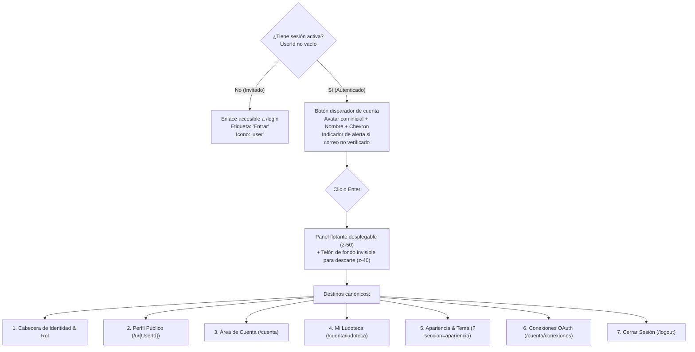

# Diseño Técnico de Arquitectura — INC-61: Menú de Cuenta y Estado de Sesión en la Cabecera

## 1. Arquitectura del Componente `AccountMenu.razor`

### 1.1 Ubicación e Inyecciones
Fichero: `src/Ludeka.Web/Components/Shared/AccountMenu.razor`.
Directivas e Inyecciones:
```razor
@implements IDisposable
@using Ludeka.Application.Contracts
@using Ludeka.Application.Features.Identity
@inject ICurrentUserService CurrentUserService
@inject IAccountConnectionsService ConnectionsService
@inject NavigationManager Navigation
```

### 1.2 Estructura del Componente



### 1.3 Marcado y Semántica HTML

```html
@if (!HasSession)
{
    <a href="/login"
       title="Entrar en Ludeka"
       class="px-2.5 py-1.5 rounded-full bg-[var(--bg-surface-elevated)] text-[var(--text-primary)] border border-[var(--border-subtle)] hover:border-[var(--brand-primary)] transition-all flex items-center gap-1.5 text-xs font-semibold shadow-sm shrink-0 min-h-[24px] min-w-[24px] focus:outline-none focus-visible:ring-2 focus-visible:ring-[var(--brand-primary)] focus-visible:ring-offset-2">
        <Icon Name="user" Size="14" />
        <span class="sr-only sm:not-sr-only">Entrar</span>
    </a>
}
else
{
    <div class="relative" @onkeydown="HandleKeyDown">
        <button type="button"
                @onclick="ToggleMenu"
                aria-expanded="@_isOpen"
                aria-haspopup="menu"
                aria-label="Menú de cuenta de @CurrentUserService.UserName"
                class="px-2.5 py-1.5 rounded-full bg-[var(--bg-surface-elevated)] text-[var(--text-primary)] border transition-all flex items-center gap-1.5 text-xs font-semibold shadow-sm shrink-0 min-h-[24px] focus:outline-none focus-visible:ring-2 focus-visible:ring-[var(--brand-primary)] focus-visible:ring-offset-2 @(_isOpen ? "border-[var(--brand-primary)] text-[var(--brand-primary)]" : "border-[var(--border-subtle)] hover:border-[var(--brand-primary)]")">
            
            <!-- Avatar sobrio con la inicial -->
            <span class="w-4 h-4 rounded-full bg-[var(--brand-primary)]/20 text-[var(--brand-primary)] font-bold text-[0.65rem] flex items-center justify-center leading-none">
                @UserInitial
            </span>

            <span class="sr-only sm:not-sr-only truncate max-w-[8rem]">@CurrentUserService.UserName</span>

            <!-- Indicador sutil de alerta si el correo no está verificado -->
            @if (_needsEmailNotice)
            {
                <span class="w-2 h-2 rounded-full bg-amber-500 animate-pulse" title="Correo pendiente de verificación"></span>
            }

            <span class="text-[0.65rem] transition-transform duration-200 @(_isOpen ? "rotate-180" : "")">▼</span>
        </button>

        @if (_isOpen)
        {
            <div class="fixed inset-0 z-40" @onclick="CloseMenu"></div>
            <div class="absolute right-0 top-full mt-2 w-64 rounded-2xl bg-[var(--bg-card)] border border-[var(--border-subtle)] shadow-2xl p-2 z-50 text-xs space-y-1 animate-fade-in"
                 role="menu"
                 aria-label="Opciones de cuenta">
                
                <!-- Cabecera con datos de cuenta -->
                <div class="px-3 py-2 border-b border-[var(--border-subtle)] mb-1">
                    <p class="font-bold text-sm text-[var(--text-primary)] truncate">@CurrentUserService.UserName</p>
                    <p class="text-[0.7rem] text-[var(--text-muted)] truncate">@RoleLabel</p>
                </div>

                <!-- Enlaces del menú -->
                <a href="@PublicProfileUrl" @onclick="CloseMenu" role="menuitem" class="flex items-center gap-2 px-3 py-2 rounded-xl text-[var(--text-secondary)] hover:text-[var(--text-primary)] hover:bg-[var(--bg-surface-elevated)] transition-colors">
                    <Icon Name="user" Size="14" />
                    <span>Mi Perfil Público</span>
                </a>
                
                <a href="/cuenta" @onclick="CloseMenu" role="menuitem" class="flex items-center gap-2 px-3 py-2 rounded-xl text-[var(--text-secondary)] hover:text-[var(--text-primary)] hover:bg-[var(--bg-surface-elevated)] transition-colors">
                    <Icon Name="settings" Size="14" />
                    <span>Área de Cuenta</span>
                </a>

                <a href="/cuenta/ludoteca" @onclick="CloseMenu" role="menuitem" class="flex items-center gap-2 px-3 py-2 rounded-xl text-[var(--text-secondary)] hover:text-[var(--text-primary)] hover:bg-[var(--bg-surface-elevated)] transition-colors">
                    <Icon Name="library" Size="14" />
                    <span>Mi Ludoteca</span>
                </a>

                <a href="/cuenta/ludoteca?seccion=apariencia" @onclick="CloseMenu" role="menuitem" class="flex items-center gap-2 px-3 py-2 rounded-xl text-[var(--text-secondary)] hover:text-[var(--text-primary)] hover:bg-[var(--bg-surface-elevated)] transition-colors">
                    <Icon Name="palette" Size="14" />
                    <span>Apariencia & Tema</span>
                </a>

                <a href="/cuenta/conexiones" @onclick="CloseMenu" role="menuitem" class="flex items-center justify-between px-3 py-2 rounded-xl text-[var(--text-secondary)] hover:text-[var(--text-primary)] hover:bg-[var(--bg-surface-elevated)] transition-colors">
                    <div class="flex items-center gap-2">
                        <Icon Name="link" Size="14" />
                        <span>Conexiones OAuth</span>
                    </div>
                    @if (_needsEmailNotice)
                    {
                        <span class="w-2 h-2 rounded-full bg-amber-500" title="Verificación requerida"></span>
                    }
                </a>

                <div class="border-t border-[var(--border-subtle)] my-1 pt-1">
                    <a href="/logout" @onclick="CloseMenu" role="menuitem" class="flex items-center gap-2 px-3 py-2 rounded-xl text-rose-500 hover:text-rose-600 hover:bg-rose-500/10 transition-colors font-medium">
                        <Icon Name="log-out" Size="14" />
                        <span>Cerrar Sesión</span>
                    </a>
                </div>
            </div>
        }
    </div>
}
```

### 1.4 Lógica de Ciclo de Vida y Accesibilidad
- `NavigationManager.LocationChanged`: Cierra el menú al navegar.
- `ConnectionsService.Invalidated`: Actualiza reactivamente el estado de `_needsEmailNotice`.
- `HandleKeyDown`: Cierra el menú ante la tecla `Escape`.
- `PublicProfileUrl`: Resuelve a `/u/{CurrentUserService.UserId}` o `/perfil/{CurrentUserService.UserId}`.

---

## 2. Integración en `MainLayout.razor`

En `src/Ludeka.Web/Components/Layout/MainLayout.razor`, las líneas 97-114 se reemplazan por:
```razor
@* Menú de cuenta y estado de sesión (INC-61) *@
<AccountMenu />
```
Manteniendo toda la estructura responsiva y sin colisión con los otros controles (`OfflineIndicator`, selector de país, acceso directo a Mi Ludoteca y panel de moderación).

---

## 3. Pruebas de Contrato y Verificación (`AccountMenuContractTests.cs`)

Se definen pruebas exhaustivas en `tests/Ludeka.UnitTests/Web/AccountMenuContractTests.cs`:
1. **Comportamiento para Visitante (Sin sesión):**
   - Renderiza el enlace a `/login` con texto "Entrar".
   - No expone el menú desplegable ni atributos de menú activo.
2. **Comportamiento para Usuario Autenticado (Con sesión):**
   - Renderiza el disparador con la inicial y el nombre de usuario.
   - Expone `aria-haspopup="menu"` y `aria-expanded`.
   - Al abrir, expone todos los enlaces canónicos (`/u/{UserId}`, `/cuenta`, `/cuenta/ludoteca`, `/cuenta/ludoteca?seccion=apariencia`, `/cuenta/conexiones`, `/logout`).
3. **Indicador de Correo No Verificado:**
   - Muestra indicador de advertencia cuando `HasVerifiedProviderEmailAsync` devuelve `false`.
4. **Contrato de Salida Limpia:**
   - El enlace de salida apunta con exactitud al endpoint `/logout`.
