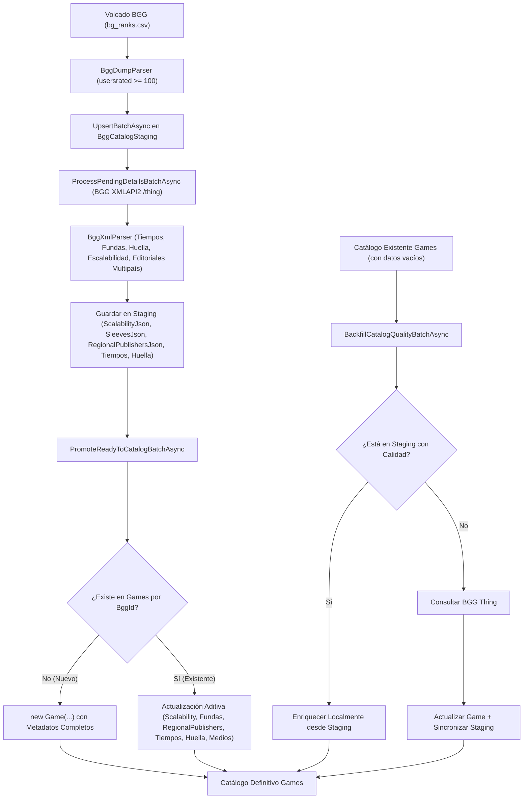

# Diseño Técnico: change-73-ingesta-enriquecimiento-catalogo

> **Incremento:** INC-73 (Ampliación Ingesta Masiva BGG >100 opiniones, Anti-Duplicados, Enriquecimiento Integral y Localización Territorial Multipaís de Editoriales y Títulos)  
> **Estado:** Propuesto / En revisión  
> **Fecha:** 2026-09-27  

---

## 1. Decisiones de Diseño y Arquitectura

### D1: Umbral de 100 opiniones como estándar de tracción comunitaria
- Se reduce el umbral de `minUsersRated` de 1000 a 100 en `BggMassIngestionOptions` y `BggDumpParser`.
- Captura entre 15.000 y 20.000 títulos lúdicos con repercusión comunitaria en el archivo diario `bg_ranks.csv`.

### D2: Idempotencia estricta por `BggId` y descarte / actualización aditiva
- En base de datos, `Game.BggId` cuenta con índice único `IsUnique()`.
- En `PromoteReadyToCatalogBatchAsync`, la comprobación `await _gameRepo.GetByBggIdAsync(item.BggId)` bifurca deterministamente:
  - Si es nuevo: se inserta como `new Game(...)`.
  - Si ya existe: se descarta de la inserción y se aplica actualización aditiva (`existing.UpdateScalability(...)`, `existing.UpdateSleeves(...)`, `existing.UpdateDuration(...)`, `existing.UpdateFootprint(...)`, `existing.UpdateRegionalPublishers(...)`, `existing.UpdateMediaUrls(...)`).
  - No se producen colisiones de clave ni excepciones de concurrencia.

### D3: Serialización JSON en Staging para tipos complejos
- `BggCatalogStagingItem` almacena `ScalabilityJson`, `SleevesJson` y `RegionalPublishersJson` como cadenas de texto (JSON) para mantener el modelo de staging ligero y desacoplado del ChangeTracker.
- Métodos utilitarios tipados devuelven colecciones inmutables `IReadOnlyList<T>`.

### D4: Fallback determinista de escalabilidad
- Proyección determinista sobre el rango `[minplayers .. maxplayers]` cuando la encuesta no tiene votos (`MustPlay` si `min == max`, `Recommended` si `min < max`), garantizando semáforo siempre presente.

### D5: Inferencia heurística de huella en mesa (TableFootprint)
- `SmallTable`: Juegos de cartas, dados, microjuegos, viaje y fiesta con duración $\le 45$ min.
- `TableMonster`: Wargames, miniaturas, civilización, 4X y cajas grandes, o duración $\ge 150$ min.
- `StandardTable`: Tableros estándar y juegos intermedios.

### D6: Backfill retroactivo de dos niveles (Staging-First)
- Nivel 1: Actualización instantánea local si el juego ya existe en staging con metadatos de calidad.
- Nivel 2: Consulta a `_bggClient.FetchGameByBggIdAsync(game.BggId)` y sincronización bidireccional en staging y catálogo.

### D7: Padrón y Matching Multipaís de Editoriales (`RegionalPublisherMatcher`)
- Se identifican las editoriales representativas para los 7 países hispanohablantes de `CountryCatalog`:
  - España (46 editoriales canónicas)
  - México (Devir México, Fractal Juegos México, Taj Mahal Games, Kokonem)
  - Argentina (Bureau de Juegos, El Troquel, Maldón, Ruibal, Pulga Escapista, ToyCo, Tinkuy)
  - Chile (Fractal Juegos, Devir Chile, Ludoismo, Dentro de la Caja)
  - Colombia (Devir Colombia, Borrasca Juegos)
  - Perú (Malabares Juegos)
  - Uruguay (Bicho Canasto)
- `RegionalPublisherMatcher` examina todos los enlaces `boardgamepublisher` del XML de BGG y genera las entradas `RegionalPublisherEntry`:
  `{ CountryCode = "AR", CountryName = "Argentina", PublisherName = "Bureau de Juegos", PublisherSlug = "bureau-de-juegos" }`.
- Si hay editorial de España, se asigna además a `SpanishPublisher` por compatibilidad.
- `Publisher` preserva la editorial original de creación internacional.

### D8: Localización de Ficha de Juego y Tarjetas
- `GameDetail.razor` consulta el país del contexto (`currentCountry`):
  - Muestra la editorial del país del usuario (`game.GetPublisherForCountry(currentCountry)`).
  - Enlace directo a la ficha de la editorial en `/directorios/editoriales/{slug}`.
  - Referencia secundaria a la editorial original: *"Editorial original: {game.Publisher}"*.
  - Desglose informativo de otras ediciones internacionales disponibles.
  - Título adaptado al idioma del usuario (`game.GetTitleForCountry(currentCountry)`), con el título original como subtítulo discreto si difiere.
- `PublisherDetail.razor`: las páginas de editoriales de cualquier país soportado listan los juegos que editan o licencian en su territorio.

### D9: Búsquedas Multidimensionales en Repositorio
- `SqliteGameRepository.SearchAsync` busca por texto contra:
  `SpanishTitle`, `OriginalTitle`, `Publisher`, `SpanishPublisher` y nombres en `RegionalPublishers`.
- `SqliteGameRepository.GetByPublisherAsync` busca coincidencias en `Publisher`, `SpanishPublisher` y `RegionalPublishers`.

### D10: Metodología de Implementación
- Implementación directa por capas sin ciclo estricto TDD paso a paso, asegurando la suite completa de pruebas unitarias al 100% en verde al finalizar.

---

## 2. Diagrama de Flujo del Pipeline Enriquecido



---

## 3. Modificaciones en el Modelo de Datos

### 3.1 `ValueObjects`
```csharp
public record RegionalPublisherEntry(string CountryCode, string CountryName, string PublisherName, string? PublisherSlug = null);
public record LocalizedTitleEntry(string CountryCode, string Title);
```

### 3.2 `BggCatalogStagingItem` (`Ludeka.Core.Entities`)
```csharp
public int MinPlayTimeMinutes { get; private set; }
public int MaxPlayTimeMinutes { get; private set; }
public TableFootprint InferredFootprint { get; private set; } = TableFootprint.StandardTable;
public string? ScalabilityJson { get; private set; }
public string? SleevesJson { get; private set; }
public string? SpanishPublisher { get; private set; }
public string? RegionalPublishersJson { get; private set; }

public IReadOnlyList<ScalabilityEntry> GetScalability();
public IReadOnlyList<SleeveItem> GetSleeves();
public IReadOnlyList<RegionalPublisherEntry> GetRegionalPublishers();
public void UpdateInferredFootprint(TableFootprint footprint);
public void UpdateSpanishPublisher(string? spanishPublisher);
public void UpdateRegionalPublishers(string? regionalPublishersJson);
```

### 3.3 `Game` (`Ludeka.Core.Entities`)
```csharp
public string? SpanishPublisher { get; private set; }
public List<RegionalPublisherEntry> RegionalPublishers { get; private set; } = [];
public List<LocalizedTitleEntry> LocalizedTitles { get; private set; } = [];

public string GetPublisherForCountry(string? country = null);
public string GetTitleForCountry(string? country = null);

public void UpdateScalability(IEnumerable<ScalabilityEntry> scalability);
public void UpdateDuration(GameDuration duration);
public void UpdateFootprint(TableFootprint footprint);
public void UpdateSleeves(IEnumerable<SleeveItem> sleeves);
public void UpdateRegionalPublishers(IEnumerable<RegionalPublisherEntry> regionalPublishers, string? spanishPublisher = null);
public void UpdateLocalizedTitles(IEnumerable<LocalizedTitleEntry> titles);
```

---

## 4. Contratos de Interfaz

### 4.1 `IBggMassIngestionService`
```csharp
Task<int> BackfillCatalogQualityBatchAsync(int batchSize = 50, CancellationToken ct = default);
Task<int> RunScheduledBackfillCatalogQualityBatchAsync(int batchSize = 50, CancellationToken ct = default);
```

### 4.2 `IGameRepository`
```csharp
Task<IReadOnlyList<Game>> GetGamesPendingQualityBackfillAsync(int limit = 50, CancellationToken ct = default);
Task<IReadOnlyList<Game>> GetByPublisherAsync(string publisherName, CancellationToken ct = default);
```

---

## 5. Migración EF Core

Nombre: `20260927010318_AddStagingQualityFields` (y extensión de columnas/JSON).
- `BggCatalogStaging`:
  - `InferredFootprint` (int, default 1)
  - `MinPlayTimeMinutes` (int, default 0)
  - `MaxPlayTimeMinutes` (int, default 0)
  - `ScalabilityJson` (string/text, nullable)
  - `SleevesJson` (string/text, nullable)
  - `SpanishPublisher` (string, max 200, nullable)
  - `RegionalPublishersJson` (string/text, nullable)
- `Games`:
  - `SpanishPublisher` (string, max 200, nullable)
  - `RegionalPublishers` (mapeo `.ToJson()` nativo EF Core 10)
  - `LocalizedTitles` (mapeo `.ToJson()` nativo EF Core 10)

---

## 6. Estrategia de Pruebas

1. **Parser Tests (`BggXmlParserTests.cs`):**
   - Extracción de tiempos reales y cálculo de tiempo estimado por jugador.
   - Fallback determinista de escalabilidad cuando la encuesta comunitaria no tiene votos.
   - Inferencia analítica de huella en mesa (`SmallTable`, `StandardTable`, `TableMonster`).
   - Detección de editoriales en múltiples países (España, Argentina, México, Chile).
2. **Streaming Parser Tests (`BggDumpParserTests.cs`):**
   - Filtrado de volcado con umbral `minUsersRated = 100`.
3. **Ingestion & Promotion Tests (`BggMassIngestionServiceTests.cs`):**
   - Inserción y actualización idempotente sin duplicación de `Game` en promoción.
   - Persistencia de escalabilidad, fundas y editoriales regionales desde staging a catálogo.
   - Ejecución del ciclo de backfill retroactivo con actualización correcta de entidades existentes.
4. **Repository Tests (`SqliteGameRepositoryTests.cs`):**
   - Consulta `GetGamesPendingQualityBackfillAsync` filtrando juegos pendientes de enriquecimiento.
   - Búsqueda en `GetByPublisherAsync` y `SearchAsync` por editoriales regionales.
5. **Component Tests (`GameDetailTests.cs` / `PublisherDetailTests.cs`):**
   - Renderizado de editorial local según país del usuario.
   - Asociación correcta de juegos en las páginas de editoriales de cualquier país soportado.
