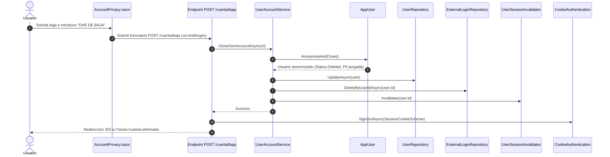

# Diseño Técnico: INC-75 — Baja de Usuarios, Anonimización y Borrado Lógico (RGPD / Derecho al Olvido)

## 1. Arquitectura del Dominio

### 1.1. Estado de Usuario (`UserStatus`)
En `src/Ludeka.Core/Enums/UserStatus.cs`:
```csharp
namespace Ludeka.Core.Enums;

public enum UserStatus
{
    Active = 0,
    Suspended = 1,
    Deleted = 2
}
```

### 1.2. Entidad `AppUser`
En `src/Ludeka.Core/Entities/AppUser.cs`:
- Incorporación del método de dominio `AnonymizeAndClose(string? reason = null)`:
```csharp
/// <summary>
/// Anonimiza de forma irreversible los datos personales identificables (PII) del usuario,
/// revoca todos los permisos y asigna el estado Deleted en cumplimiento del derecho al olvido (RGPD).
/// </summary>
public void AnonymizeAndClose(string? reason = null)
{
    if (Role == UserRole.FoundingTeam)
        throw new InvalidOperationException("No está permitido dar de baja a un miembro de la Mesa Fundadora.");

    Status = UserStatus.Deleted;
    Role = UserRole.CommunityUser;
    Permissions = ModeratorPermission.None;
    UserName = "Usuario eliminado";
    Email = $"deleted-{Guid.NewGuid():N}@deleted.ludeka.es";
    Country = null;
    UpdatedAt = DateTimeOffset.UtcNow;
}
```

---

## 2. Capa de Infraestructura y Repositorios

### 2.1. `IExternalLoginRepository`
En `src/Ludeka.Application/Contracts/IExternalLoginRepository.cs`:
```csharp
/// <summary>
/// Elimina todos los vínculos externos asociados a un usuario para liberar de inmediato los proveedores OAuth.
/// </summary>
Task DeleteByUserIdAsync(string userId, CancellationToken cancellationToken = default);
```

En `src/Ludeka.Infrastructure/Data/ExternalLoginRepository.cs`:
```csharp
public async Task DeleteByUserIdAsync(string userId, CancellationToken cancellationToken = default)
{
    if (string.IsNullOrWhiteSpace(userId)) return;
    var normalizedUserId = userId.Trim().ToLowerInvariant();
    var logins = await _context.ExternalLogins
        .Where(l => l.UserId == normalizedUserId)
        .ToListAsync(cancellationToken);

    if (logins.Count > 0)
    {
        _context.ExternalLogins.RemoveRange(logins);
        await _context.SaveChangesAsync(cancellationToken);
    }
}
```

### 2.2. Esquema de Base de Datos y Compatibilidad EF Core
- El enum `UserStatus` se almacena como `int` en la columna `Status` de `AppUsers`.
- Añadir el valor `Deleted = 2` no requiere alteración estructural de tablas (DDL) en SQLite ni en PostgreSQL.
- El índice `user.HasIndex(u => u.Email).IsUnique()` queda protegido porque cada correo sintético generado posee un UUID único de 32 caracteres hexadecimales.

---

## 3. Capa de Aplicación y Casos de Uso

### 3.1. Caso de Uso: Autoservicio de Baja (`IUserAccountService`)
Contrato en `src/Ludeka.Application/Contracts/IUserAccountService.cs`:
```csharp
namespace Ludeka.Application.Contracts;

public record AccountClosureResult(bool Success, string Message);

public interface IUserAccountService
{
    Task<AccountClosureResult> CloseOwnAccountAsync(CancellationToken ct = default);
}
```

Implementación en `src/Ludeka.Application/Features/Account/UserAccountService.cs`:
1. Valida `ICurrentUserService.UserId`. Si no está autenticado, arroja `UnauthorizedAccessException`.
2. Recupera la entidad `AppUser` del repositorio.
3. Si el usuario ya está en `UserStatus.Deleted`, retorna error idempotente.
4. Si el usuario es `UserRole.FoundingTeam`, arroja `InvalidOperationException`.
5. Ejecuta `user.AnonymizeAndClose()`.
6. Actualiza el usuario en `IUserRepository`.
7. Purga logins externos: `await _externalLoginRepository.DeleteByUserIdAsync(userId, ct)`.
8. Invalida sesiones activas: `_sessionInvalidator?.Invalidate(userId)`.
9. Retorna resultado exitoso.

### 3.2. Caso de Uso: Baja Administrativa (`IUserManagementService.AnonymizeUserAsync`)
Extensión en `src/Ludeka.Application/Contracts/IUserManagementService.cs`:
```csharp
Task<AppUserDto> AnonymizeUserAsync(string userId, string reason, CancellationToken ct = default);
```

En `src/Ludeka.Application/Features/Admin/UserManagementService.cs`:
1. `EnsureFoundingTeam()` (o autorización con `CanManageUsers`).
2. Valida parámetros y existencia de `AppUser`.
3. Invoca `user.AnonymizeAndClose(reason)`.
4. Persiste en `_userRepository.UpdateAsync`.
5. Purga logins externos: `_externalLoginRepository.DeleteByUserIdAsync(user.Id, ct)`.
6. Registra auditoría en `IAuditService.RecordChangeAsync`:
   - `Action = AuditAction.Deleted`
   - `EntityType = AuditEntityType.User`
   - `EntityId = user.Id`
   - `EntityName = "Usuario eliminado"`
   - `Summary = $"Baja y anonimización de cuenta tramitada por {currentUser.UserName}. Motivo: {reason}"`
7. Invalida la sesión: `_sessionInvalidator?.Invalidate(user.Id)`.

---

## 4. Endpoints HTTP y Capa Web

### 4.1. Endpoint de Cierre de Cuenta
En `Program.cs`:
```csharp
app.MapPost("/cuenta/baja", async (
    HttpContext httpContext,
    [FromServices] IAntiforgery antiforgery,
    [FromServices] IUserAccountService accountService) =>
{
    try
    {
        await antiforgery.ValidateRequestAsync(httpContext);
    }
    catch (AntiforgeryValidationException)
    {
        return Results.BadRequest(new { error = "Token antiforgery ausente o inválido." });
    }

    var result = await accountService.CloseOwnAccountAsync(httpContext.RequestAborted);
    if (!result.Success)
    {
        return Results.BadRequest(new { error = result.Message });
    }

    await httpContext.SignOutAsync(ExternalAuthenticationSchemes.SessionCookieScheme);
    return Results.Redirect("/?aviso=cuenta-eliminada");
}).RequireAuthorization();
```

---

## 5. Componentes de Interfaz de Usuario (Blazor)

### 5.1. `AccountPrivacy.razor` (Autoservicio)
- **Tarjeta Zona de Peligro:** Con borde sutil ámbar/rojo y tipografía de advertencia.
- **Modal de Confirmación:**
  - Requiere escribir el texto exacto `"DAR DE BAJA"` en un input accesible.
  - Al completar la palabra y presionar el botón de confirmación, envía el formulario POST con antiforgery a `/cuenta/baja`.

### 5.2. `UserManagement.razor` (Administración)
- En la cuadrícula de usuarios:
  - Si `user.Status == UserStatus.Deleted`: Badge gris/neutro *"Eliminado"*, botones de rol y suspensión ocultos/inhabilitados.
  - Si `user.Role != UserRole.FoundingTeam` y `user.Status != UserStatus.Deleted`: Botón *«Dar de baja»* con icono `trash-2`.
- Modal de confirmación administrativa solicitando justificación textual para la bitácora de auditoría.

---

## 6. Diagrama de Secuencia: Flujo de Baja Voluntaria


