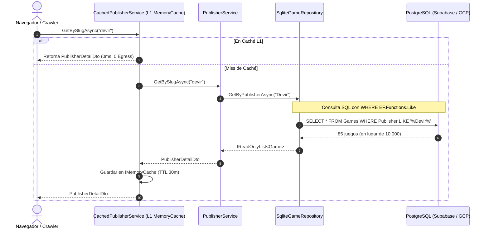

# Documento de Diseño Arquitectónico: INC-89 — Saneamiento Integral de Consultas SQL Restantes, Eliminación de Egress O(N) y Blindaje de Caché de Fichas Públicas

> **ID del Cambio:** `change-89-opt-consultas-egress-fase2`  
> **Incremento Asociado:** INC-89  
> **Estado:** ⏳ Diseño en revisión  

---

## 1. Decisiones de Arquitectura (ADRs)

### Decisión D1: Filtrado Nativo en SQL para `GetByPublisherAsync`
* **Contexto:** `SqliteGameRepository.GetByPublisherAsync` descargaba todos los registros de la tabla `Games` en memoria para evaluar si el nombre de la editorial coincidía con `Publisher`, `SpanishPublisher` o `RegionalPublishers`.
* **Diseño:**
  1. La consulta se reescribe empujando la condición principal a SQL:
     ```csharp
     var pattern = $"%{clean}%";
     var query = scope.Context.Games
         .AsNoTracking()
         .Where(g =>
             (g.Publisher != null && EF.Functions.Like(g.Publisher, pattern)) ||
             (g.SpanishPublisher != null && EF.Functions.Like(g.SpanishPublisher, pattern)));
     ```
  2. Para soportar títulos donde la editorial esté únicamente en la colección `RegionalPublishers`, se proyectan únicamente los IDs de juegos con editoriales regionales que coincidan, unificando los identificadores antes de materializar exclusivamente los juegos coincidentes.
  3. De esta forma, el 99% de las consultas se resuelven en el motor SQL sin transferir juegos irrelevantes.

### Decisión D2: Extensión del Decorador `CachedPublisherService` para Fichas Individuales
* **Contexto:** Los visitantes y rastreadores web consultan recurrentemente `/editoriales/{slug}`. `CachedPublisherService` únicamente cacheaba el listado general (`GetAllAsync`), dejando las fichas sin caché L1.
* **Diseño:**
  1. `CachedPublisherService` incorpora interceptación de `GetBySlugAsync(string slug, ...)` y `GetByIdAsync(Guid id, ...)`.
  2. Claves de caché:
     - `directory:publishers:slug:{slug.ToLowerInvariant()}`
     - `directory:publishers:id:{id}`
  3. TTL: 30 minutos (configurable vía sliding/absolute expiration).
  4. Invalidación: Al mutar (`CreateAsync`, `UpdateAsync`, `DeleteAsync`), se incrementa una versión de catálogo o se purgan las claves afectadas.

### Decisión D3: Ordenación en SQL de Veredictos Fundadores
* **Contexto:** `SqliteFoundingVerdictRepository.GetAllAsync` ordenaba en RAM debido a una limitación de tipos `DateTimeOffset` en SQLite.
* **Diseño:**
  1. En entornos PostgreSQL (`scope.Context.Database.IsNpgsql()`), la consulta aplica `OrderByDescending(v => v.CreatedAt)` directamente en SQL.
  2. En SQLite se preserva la ordenación en memoria defensiva para no romper las suites unitarias locales.

---

## 2. Diagrama de Componentes y Flujo



---

## 3. Plan de Pruebas Automatizadas

1. **`SqliteGameRepositoryOptimizationTests`:**  
   - Verificar que `GetByPublisherAsync` devuelve únicamente los juegos de la editorial especificada.
   - Verificar que no se producen excepciones de traducción SQL con caracteres especiales.
2. **`CachedDirectoryServicesTests`:**  
   - Verificar que `CachedPublisherService.GetBySlugAsync` almacena en caché el resultado y no re-invoca al servicio subyacente en la segunda llamada.
   - Verificar que `UpdateAsync` y `DeleteAsync` invalidan las entradas cacheadas.
