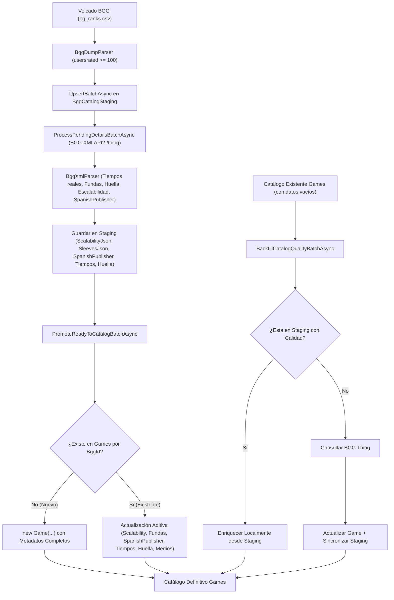

# Diseño Técnico: change-73-ingesta-enriquecimiento-catalogo

> **Incremento:** INC-73 (Ampliación Ingesta Masiva BGG >100 opiniones, Anti-Duplicados, Enriquecimiento Integral y Localización Territorial de Editoriales y Títulos)  
> **Estado:** Propuesto / En revisión  
> **Fecha:** 2026-09-27  

---

## 1. Decisiones de Diseño y Arquitectura

### D1: Umbral de 100 opiniones como estándar de tracción comunitaria
- Se reduce el umbral de `minUsersRated` de 1000 a 100.
- El archivo diario `bg_ranks.csv` de BGG contiene ~31.000 títulos. Filtrando por `>= 100` votos, se capturan entre 15.000 y 20.000 juegos de mesa reales, descartando prototipos caseros o fichas abandonadas con tracción irrelevante.
- El valor es configurable en `BggMassIngestionOptions.MinUsersRated`, inyectado mediante `IOptions<BggMassIngestionOptions>`.

### D2: Idempotencia estricta por `BggId` y descarte / actualización aditiva
- En base de datos, `Game.BggId` cuenta con índice único `IsUnique()`.
- En `PromoteReadyToCatalogBatchAsync`, la comprobación `await _gameRepo.GetByBggIdAsync(item.BggId)` bifurca deterministamente:
  - Si es nuevo: se inserta como `new Game(...)`.
  - Si ya existe: se descarta de la inserción y se aplica actualización aditiva (`existing.UpdateScalability(...)`, `existing.UpdateSleeves(...)`, `existing.UpdateDuration(...)`, `existing.UpdateFootprint(...)`, `existing.UpdateSpanishPublisher(...)`, `existing.UpdateMediaUrls(...)`).
  - No se producen colisiones de clave ni excepciones de concurrencia.

### D3: Serialización JSON en Staging para tipos complejos
- `BggCatalogStagingItem` almacena `ScalabilityJson` y `SleevesJson` como cadenas de texto (JSON) para no requerir tablas hijas en el modelo intermedio de staging, manteniendo SQLite y PostgreSQL ligeros y desacoplados del ChangeTracker.
- Métodos tipados `GetScalability()` y `GetSleeves()` devuelven colecciones inmutables `IReadOnlyList<ScalabilityEntry>` y `IReadOnlyList<SleeveItem>`.

### D4: Fallback determinista de escalabilidad
- Cuando la encuesta comunitaria de BGG no dispone de votos (`TotalVotes == 0` o nodo ausente), se genera una proyección determinista:
  - Rango oficial `[minplayers .. maxplayers]`.
  - Si `min == max`: `MustPlay` (ej. 2J en juegos para parejas).
  - Si `min < max`: `Recommended` para todas las posiciones.
- Se asegura que ningún juego en catálogo quede con semáforo vacío.

### D5: Inferencia heurística de huella en mesa (TableFootprint)
- Evaluada en el parser XML a partir de categorías, mecánicas y duración:
  - `SmallTable`: Juegos de cartas, dados, microjuegos, viaje y fiesta con duración $\le 45$ min.
  - `TableMonster`: Wargames, miniaturas, civilización, 4X y cajas grandes, o duración $\ge 150$ min.
  - `StandardTable`: Tableros estándar y juegos intermedios.

### D6: Backfill retroactivo de dos niveles (Staging-First)
- `RunScheduledBackfillCatalogQualityBatchAsync` procesa juegos existentes con metadatos por defecto:
  - Nivel 1 (Local/Instantáneo): Si el juego ya está en staging con datos de calidad, actualiza la entidad `Game` sin coste de red ni consumo de API BGG.
  - Nivel 2 (Remoto/BGG Thing): Si el juego no estaba en staging o no tenía calidad, invoca `_bggClient.FetchGameByBggIdAsync(game.BggId)`, actualiza el juego y sincroniza el staging item.

### D7: Detección y Asociación de Editorial en España (SpanishPublisher)
- BGG entrega todos los sellos editoriales en `<link type="boardgamepublisher">`.
- Se crea el catálogo y resolutor estático `SpanishPublisherMatcher` con el padrón canónico de las 46 editoriales de España presentes en `seed-directory.json` (ej. *Devir*, *Maldito Games*, *Asmodee*, *Tranjis Games*, *TCG Factory*, *Arrakis Games*, *Zacatrus*, *Doit Games*, *Salt & Pepper Games*, *GDM Games*, *Mercurio*, *MasQueOca*, *Gen X Games*, *SD Games*, *Cacahuete Games*, etc.):
  - Compara la lista de editoriales del juego contra el padrón.
  - Si encuentra coincidencia, asigna el nombre canónico de la editorial española a `SpanishPublisher`.
  - `Publisher` preserva la editorial original (habitualmente la primera en la lista de BGG).

### D8: Localización de Títulos y Preferencia Territorial
- En `GameDetail.razor` y `GameCard.razor`:
  - `SpanishTitle` es el título prioritario.
  - Si `SpanishTitle != OriginalTitle`, se muestra `OriginalTitle` en subtítulo secundario accesible.
  - Si `SpanishPublisher` está informado y difiere de `Publisher`, se muestra:
    - `Editorial en España: <a href="/directorios/editoriales/{slug}">SpanishPublisher</a>`
    - `Editorial original: Publisher`
  - En `PublisherDetail.razor`: el catálogo de la editorial muestra todos los juegos asociados mediante `GetByPublisherAsync(publisherName)`.

### D9: Búsquedas Multidimensionales en Repositorio
- `SqliteGameRepository.SearchAsync` busca por texto contra:
  `SpanishTitle`, `OriginalTitle`, `Publisher` y `SpanishPublisher`.
- `SqliteGameRepository.GetByPublisherAsync` busca coincidencias en `Publisher` o `SpanishPublisher`.

### D10: Metodología de Implementación
- Implementación directa por capas sin ciclo estricto TDD paso a paso, asegurando la suite completa de pruebas unitarias al 100% en verde al finalizar.

---

## 2. Diagrama de Flujo del Pipeline Enriquecido



---

## 3. Modificaciones en el Modelo de Datos

### 3.1 `BggCatalogStagingItem` (`Ludeka.Core.Entities`)
```csharp
public int MinPlayTimeMinutes { get; private set; }
public int MaxPlayTimeMinutes { get; private set; }
public TableFootprint InferredFootprint { get; private set; } = TableFootprint.StandardTable;
public string? ScalabilityJson { get; private set; }
public string? SleevesJson { get; private set; }
public string? SpanishPublisher { get; private set; }

public IReadOnlyList<ScalabilityEntry> GetScalability();
public IReadOnlyList<SleeveItem> GetSleeves();
public void UpdateInferredFootprint(TableFootprint footprint);
public void UpdateSpanishPublisher(string? spanishPublisher);
```

### 3.2 `Game` (`Ludeka.Core.Entities`)
```csharp
public string? SpanishPublisher { get; private set; }

public void UpdateScalability(IEnumerable<ScalabilityEntry> scalability);
public void UpdateDuration(GameDuration duration);
public void UpdateFootprint(TableFootprint footprint);
public void UpdateSleeves(IEnumerable<SleeveItem> sleeves);
public void UpdateSpanishPublisher(string? spanishPublisher);
```

---

## 4. Contratos de Interfaz

### 4.1 `IBggMassIngestionService`
```csharp
Task<int> BackfillCatalogQualityBatchAsync(int batchSize = 50, CancellationToken ct = default);
Task<int> RunScheduledBackfillCatalogQualityBatchAsync(int batchSize = 50, CancellationToken ct = default);
```

### 4.2 `IGameRepository`
```csharp
Task<IReadOnlyList<Game>> GetGamesPendingQualityBackfillAsync(int limit = 50, CancellationToken ct = default);
Task<IReadOnlyList<Game>> GetByPublisherAsync(string publisherName, CancellationToken ct = default);
```

---

## 5. Migración EF Core

Nombre: `20260927010318_AddStagingQualityFields` (y ampliación de columna `SpanishPublisher` en `Games` y `BggCatalogStaging`).
Columnas añadidas:
- En `BggCatalogStaging`:
  - `InferredFootprint` (int, default 1)
  - `MinPlayTimeMinutes` (int, default 0)
  - `MaxPlayTimeMinutes` (int, default 0)
  - `ScalabilityJson` (string/text, nullable)
  - `SleevesJson` (string/text, nullable)
  - `SpanishPublisher` (string, max 200, nullable)
- En `Games`:
  - `SpanishPublisher` (string, max 200, nullable)

---

## 6. Estrategia de Pruebas

1. **Parser Tests (`BggXmlParserTests.cs`):**
   - Extracción de tiempos reales y cálculo de tiempo estimado por jugador.
   - Fallback determinista de escalabilidad cuando la encuesta comunitaria no tiene votos.
   - Inferencia analítica de huella en mesa (`SmallTable`, `StandardTable`, `TableMonster`).
   - Detección de editorial española `SpanishPublisher` entre múltiples enlaces de `boardgamepublisher`.
2. **Streaming Parser Tests (`BggDumpParserTests.cs`):**
   - Filtrado de volcado con umbral `minUsersRated = 100`.
3. **Ingestion & Promotion Tests (`BggMassIngestionServiceTests.cs`):**
   - Inserción y actualización idempotente sin duplicación de `Game` en promoción.
   - Persistencia de escalabilidad, fundas y `SpanishPublisher` desde staging a catálogo.
   - Ejecución del ciclo de backfill retroactivo con actualización correcta de entidades existentes.
4. **Repository Tests (`SqliteGameRepositoryTests.cs`):**
   - Consulta `GetGamesPendingQualityBackfillAsync` filtrando juegos pendientes de enriquecimiento.
   - Búsqueda en `GetByPublisherAsync` y `SearchAsync` por `SpanishPublisher`.
5. **Component Tests (`GameDetailTests.cs` / `PublisherDetailTests.cs`):**
   - Renderizado de editorial española con enlace al directorio.
   - Asociación correcta de juegos en la vista de detalle de la editorial.
